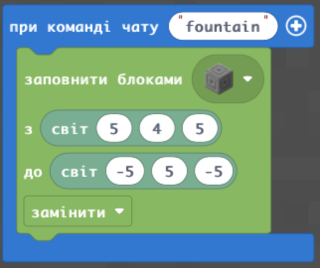
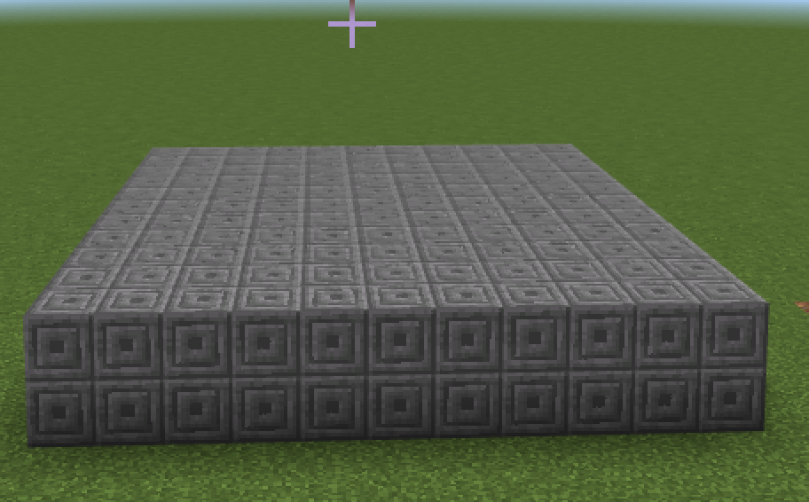
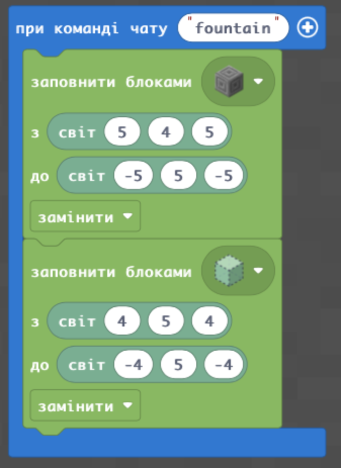
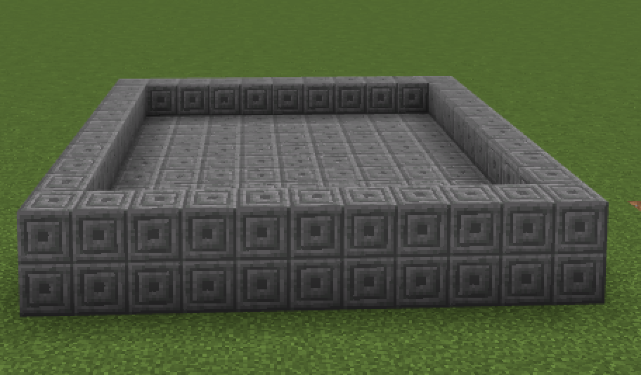
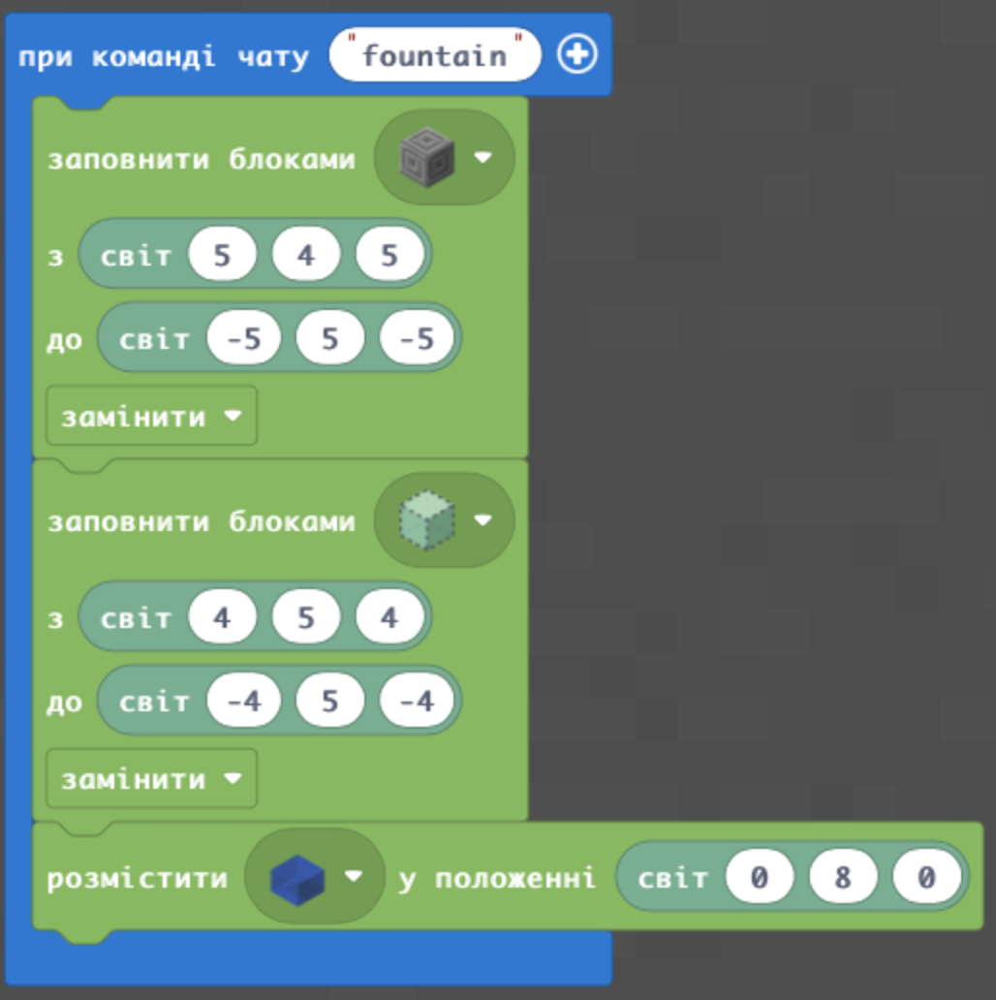
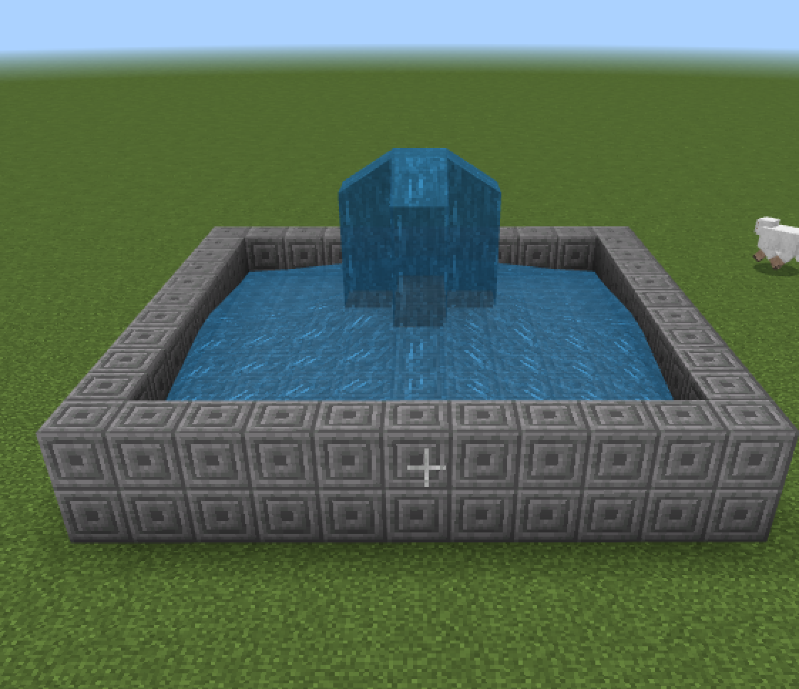
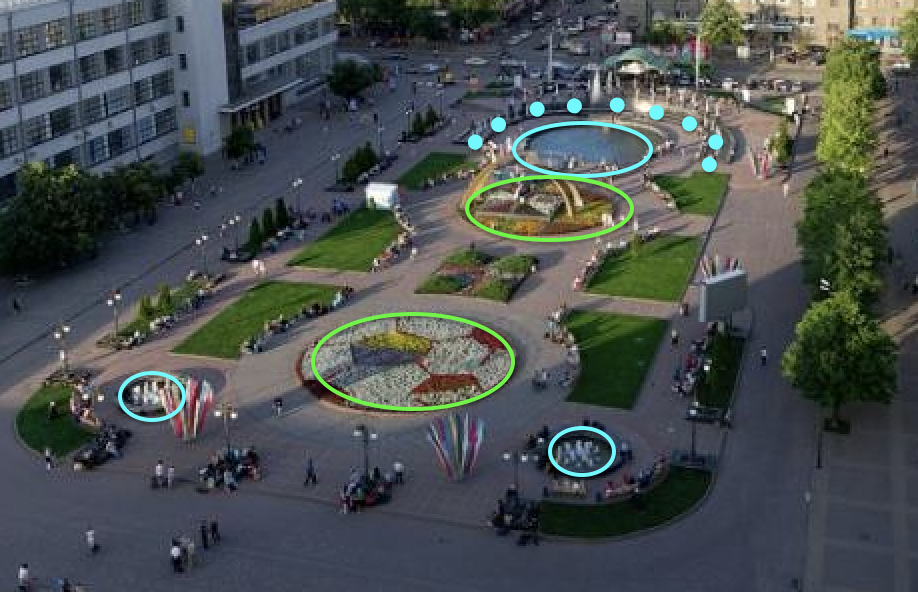

# Сади семіраміди
## Водоспади та фонтани.
#### Зробимо заготовку
  
  

#### В середині зробимо заглибення (для води)
&nbsp;
 

#### Створимо джерело води
&nbsp;
 
 

#|Завдання|Код|Результат|
|---|---|---|---|
|1.|1. Створіть фонтан. Базова частина від (5;4;5) до (-5;5;-5) із заглибленням в один блок від (4;5;4) до (-4;5;-4) з наповненням води з точки (0;8;0)   2. Створіть широкий фонтан. Базова частина від (7;4;7) до (-7;6;-7) із заглибленням в два блоки від (6;5;6) до (-6;4;-6) з наповненням води з точки (0;9;0).   3. Створіть вузький фонтан. Базова частина від (3;4;3) до (-3;7;-3) із заглибленням в три блоки від (2;6;2) до (-2;4;-2) з наповненням води з точки (0;10;0).  | | |

## Творче завдання
1. Створіть фонтан не квадартної форми.
2. Створіть фонтан круглої форми.

## Супер-творче завдання
1. Зробіть фонтани (обведено синім) та зелені насадження (обведено зеленим) як на привокзальній площі Харкова.

2. Оберіть будь-який парк із фонтанами в світі, та за його фотографією реалізуйте його репліку в Майнкрафті. 
