# Сади семіраміди
## Водоспади та фонтани.
#### Зробимо заготовку
  
  

#### В середині зробимо заглибення (для води)
&nbsp;
 

#### Створимо джерело води
&nbsp;
 
 

#|Завдання|Код|Результат|
|---|---|---|---|
|1.|1. Створіть фонтан. Базова частина від (5;4;5) до (-5;5;-5) із заглибленням в один блок від (4;5;4) до (-4;5;-4) з наповненням води з точки (0;8;0)   2. Створіть широкий фонтан. Базова частина від (7;4;7) до (-7;6;-7) із заглибленням в два блоки від (6;5;6) до (-6;4;-6) з наповненням води з точки (0;9;0).   3. Створіть вузький фонтан. Базова частина від (3;4;3) до (-3;7;-3) із заглибленням в три блоки від (2;6;2) до (-2;4;-2) з наповненням води з точки (0;10;0).  | | |

## Творче завдання
1. Створіть фонтан не квадартної форми.
2. Створіть фонтан круглої форми.

## Супер-творче завдання
1. Зробіть фонтани (обведено синім) та зелені насадження (обведено зеленим) як на привокзальній площі Харкова.

2. Оберіть будь-який парк із фонтанами в світі, та за його фотографією реалізуйте його репліку в Майнкрафті.

## Башта із водою

#|Завдання|Код|Результат|
|---|---|---|---|
|2.|1. Побудуйте башту (від точки (3;4;3) до точки  (-3;14;-3)): башта 7х7 із висотою 11 блоків. Із прорізями для майбутнього фонтану: від (3;14;0) до (-3;14;0) та від (0;14;3) до (0;14;-3)  2. Побудуйте баштй 10х10 із висотою 5 блоків із прорізами, що йдуть навхрест через центр башти. |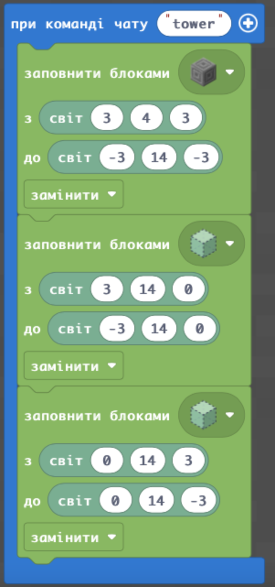  |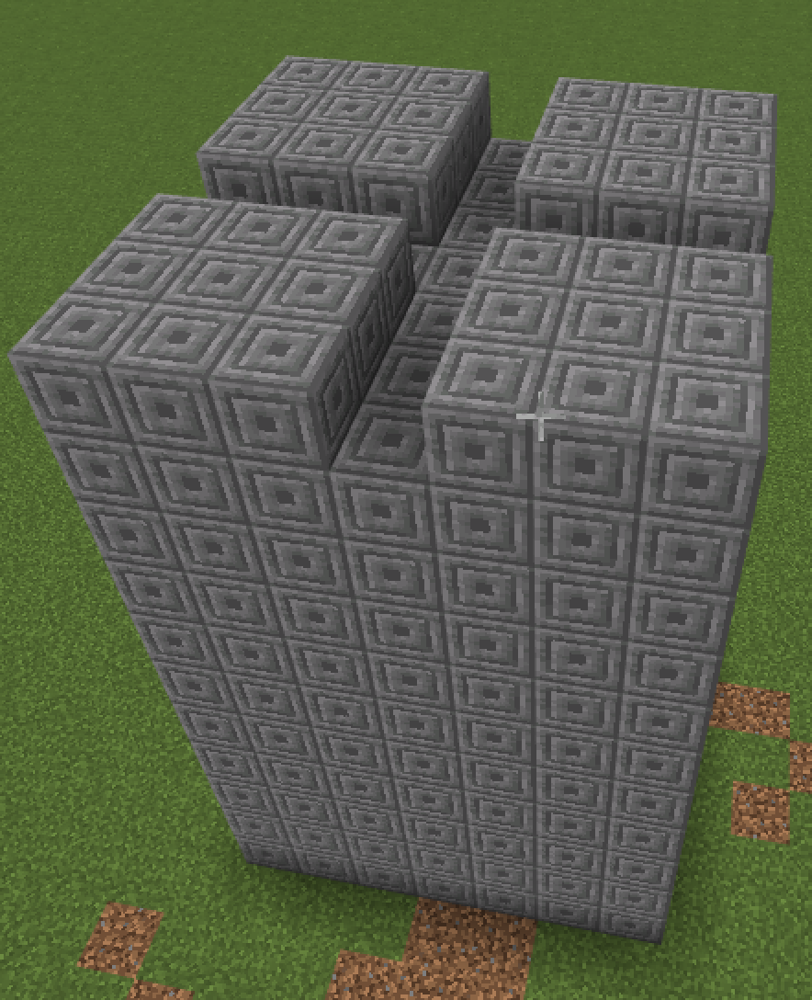 |

### Творчі завдання:
1. Залийте прорізи водою (візьміть в інвентарі відро з водою чи додайте блок із водою).
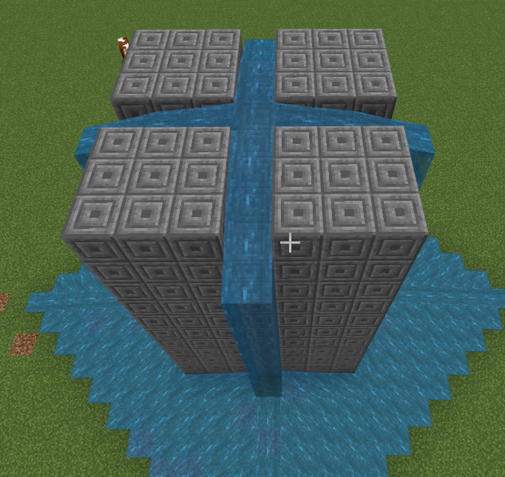
2. Додайте більше прорізів (так, щоб вони проходили через один блок).

## Ванни для води
Для того, щоб вода не розивалася при течії з будівлі додамо ванни для води.
#|Завдання|Код|Результат|
|---|---|---|---|
|3.|1. Додайте блоки ванни для збору води.|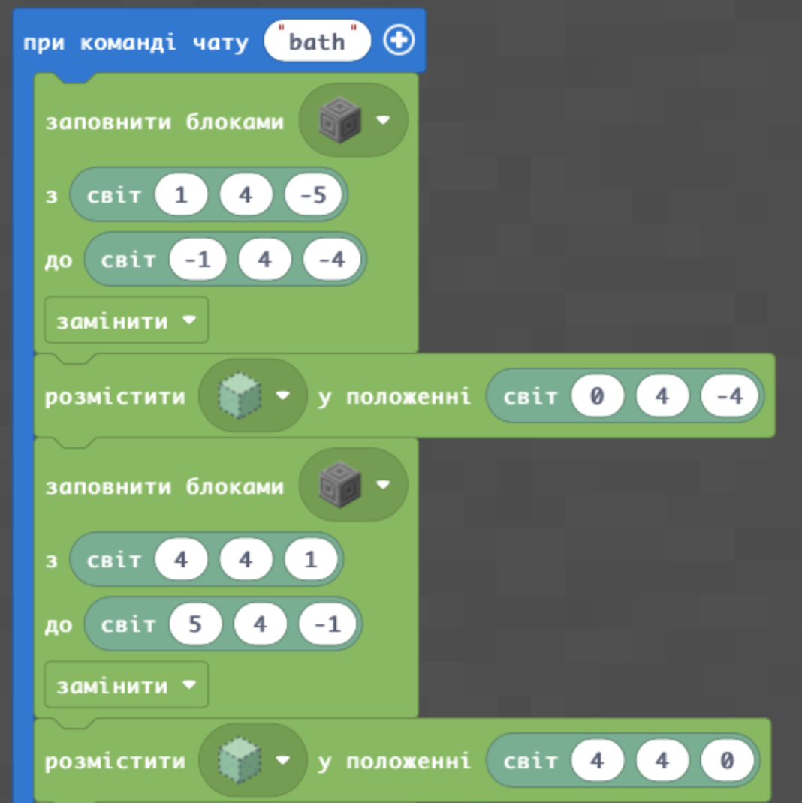 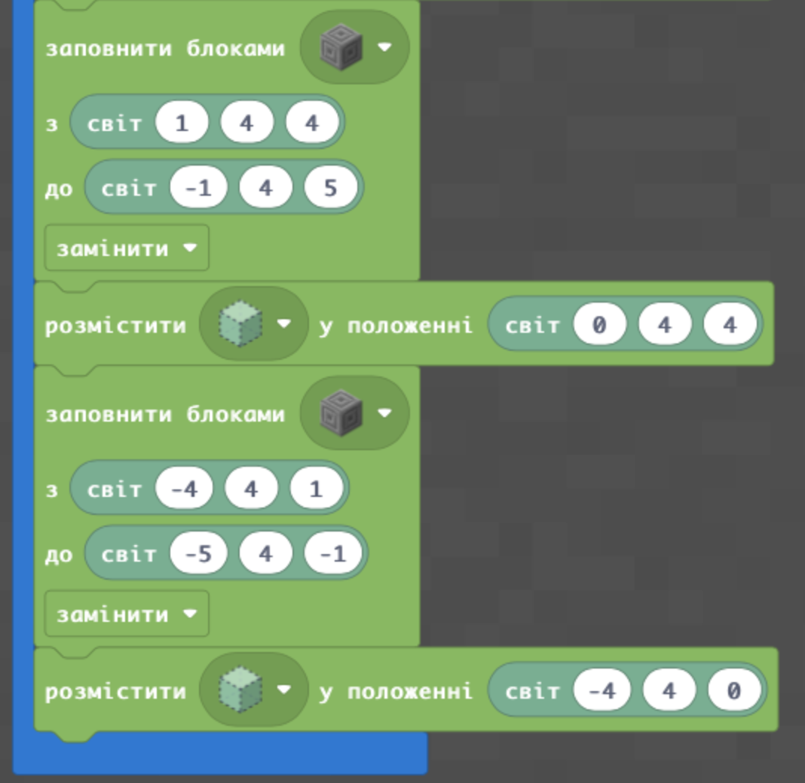|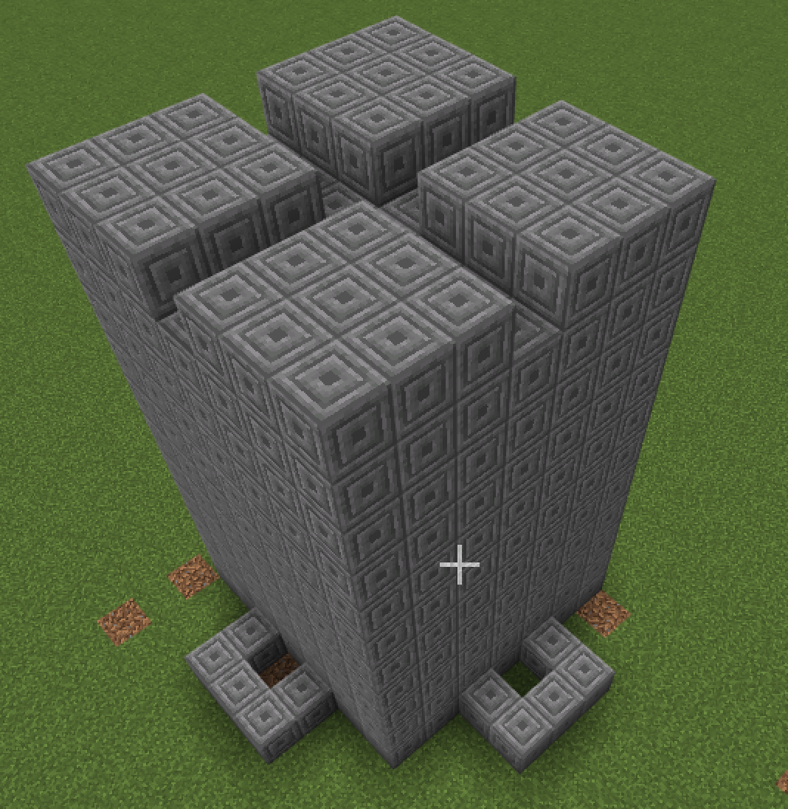|
|3.|1. Додайте блоки ванни для збору води.|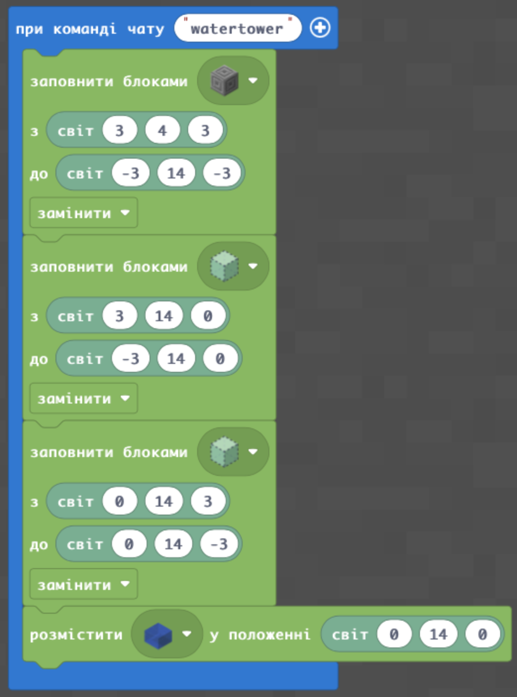|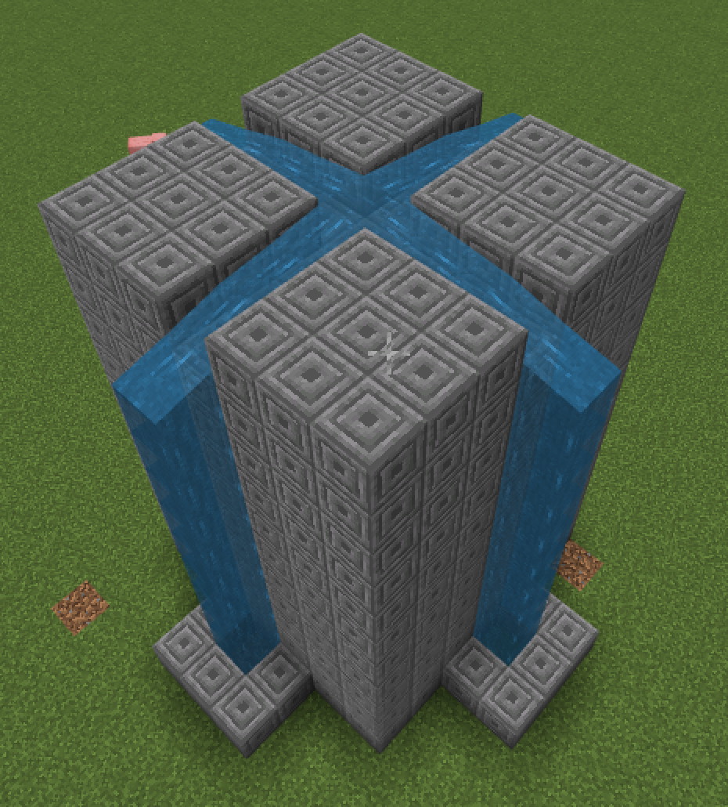|

## Робота із часом
В Minecraft є час. Найпростіша можливість познайомитись із часом - це вивести на екран поточне значення ігорового часу:
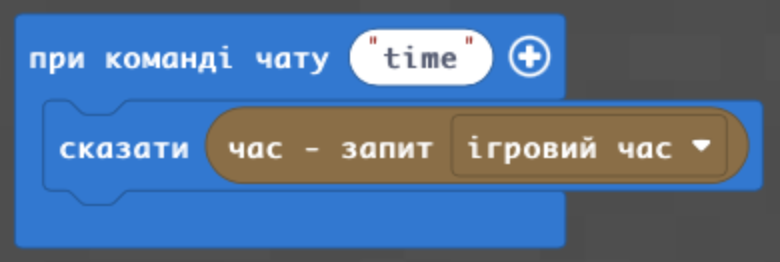  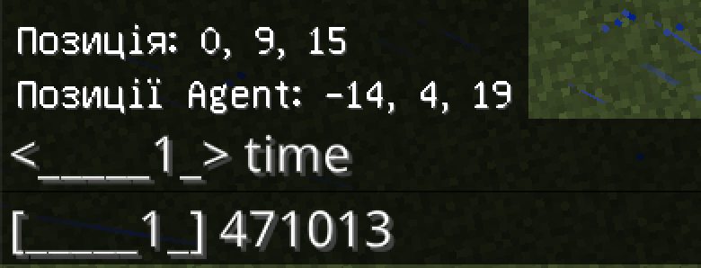

## "Живі" фонтани та час.
Найцікавішими фонтанами є ті, які працюють не постійно, а з певною періодичністю.
#|Завдання|Код|Результат|
|---|---|---|---|
|4|1. Запрограмуйте появу води, та зникнення її (заповнення місць появи води повітрям) з інтервалом 3 секунди.  
5. Запрограмуйте появу води, та зникнення її (заповнення місць появи води повітрям) з інтервалом 5 секунди.  1. Запрограмуйте появу води, та зникнення її (заповнення місць появи води повітрям) так щоб вод з'являлася на 5 секунд, а зникала на 3 секунди|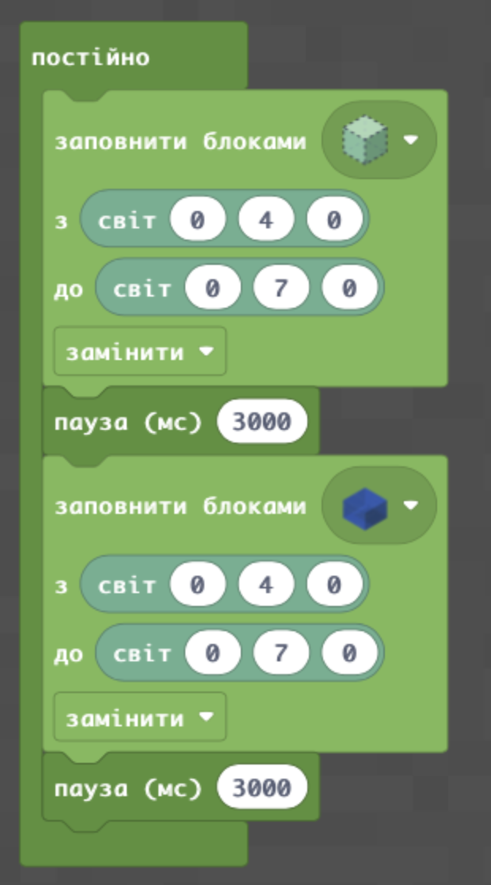|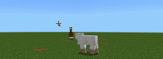|

## Творче завдання
1. Реалзуйте запрограмовані фонтани (поява/зникання води на площі, яку ви програмували в першому завданні)

## Ускладнене завдання (додаткове)
1. Реалізуйте появу та зникнення води, спираючись на ігровий час.
Крок 1. Вивід тексту на еркан.
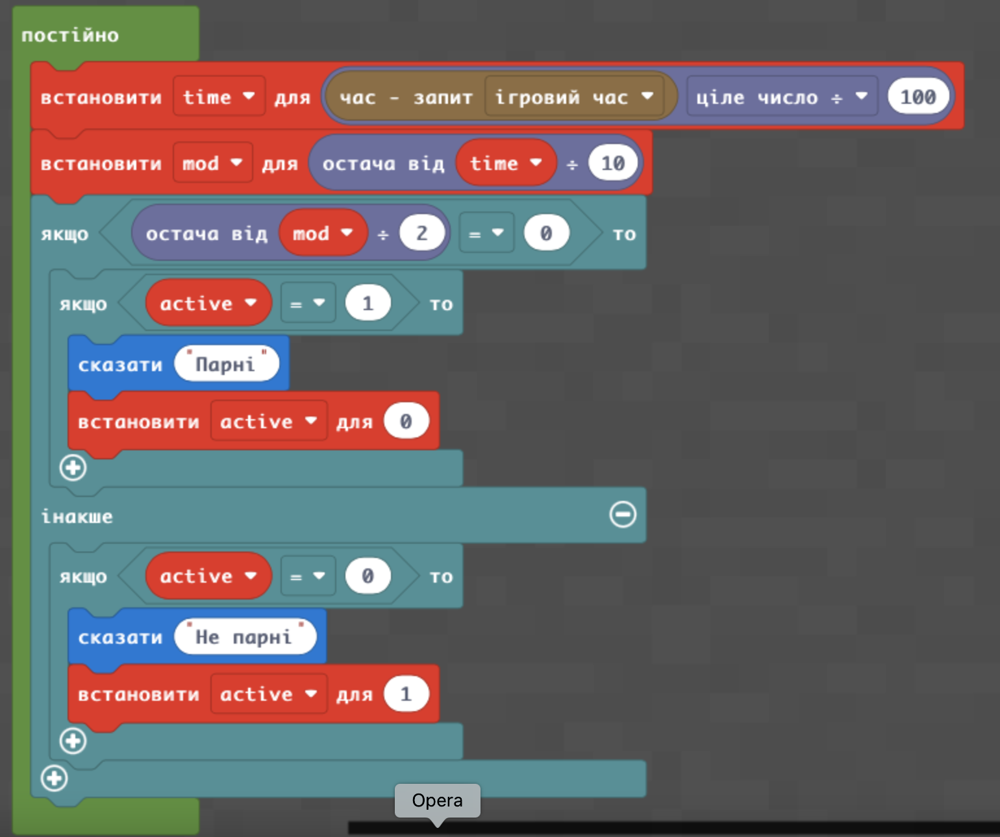  
Крок 2. Поява та зникнення води:
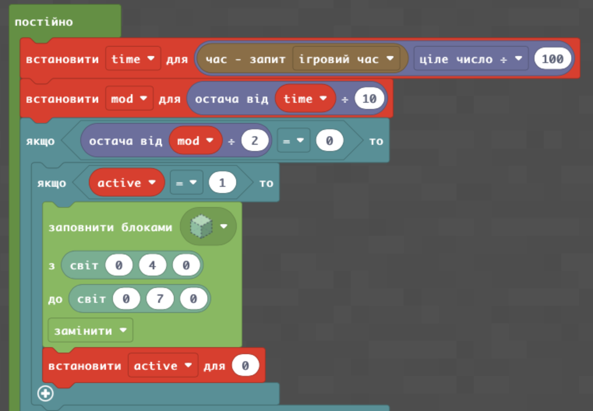  
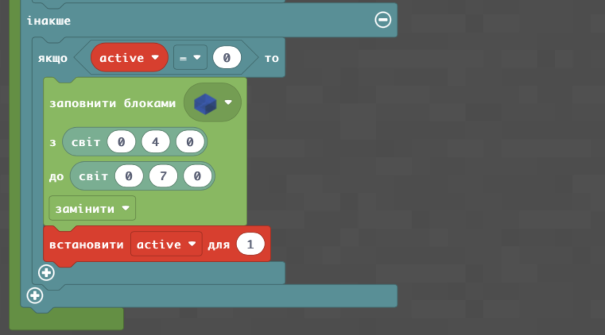  
