# Прохід по лабіринту
Для того, щоб пройти лабіринт необхідно сформулювати певні правила та керуючі сигнали, як пройти по лабіринту.
Ми використаємо показчики на землі (певні блоки, проходячі які агент повертає ліворуч або праворух), "ніть Аріадни" - зробленою за допомогою редстоуну, а також алгоритмічне проходження лабіринту.
## Управління переходом.
### Розстановка покажчиків. Поворот вліво.
Найпростішим для розуміння керуванням пересування агентом буде розстановка покажчиків: зустрічаюючи один тип блоків агент повертає вліво, другий - вправо, третій - повертається та йде назад.

Перший функціонал, який ми надамо для нашого агента, це  навчити повертати вліво, якщо агент проходить над срібним блоком.  
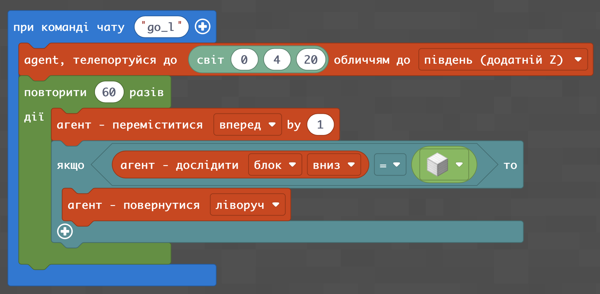

#|Завдання|Код|Результат|
|---|---|---|---|
|1|1. Запустить рух по квдрату 10*10, починаючи з точки(0;4;20), обличчям на південь, за допомогою срібних блоків запустить рух агента по точках (0;4;20),(0;4;30),(10;4;30),(10;4;20) Розставьте срібні блоки (0;3;0) до точки (1;3;30)  2. Запустить рух по квадрату 5 * 5 починаючи з точки(0;4;40), обличчям на південь, за допомогою срібних блоків запустить рух агента по точках (0;4;40),(0;4;45),(5;4;45),(5;4;40) 3. Запустить рух по квадрату 7 * 7 починаючи з точки (0;4;50), обличчям на південь, за допомогою срібних блоків запустить рух агента по точках (0;4;50),(0;4;57),(7;4;57),(7;4;50)|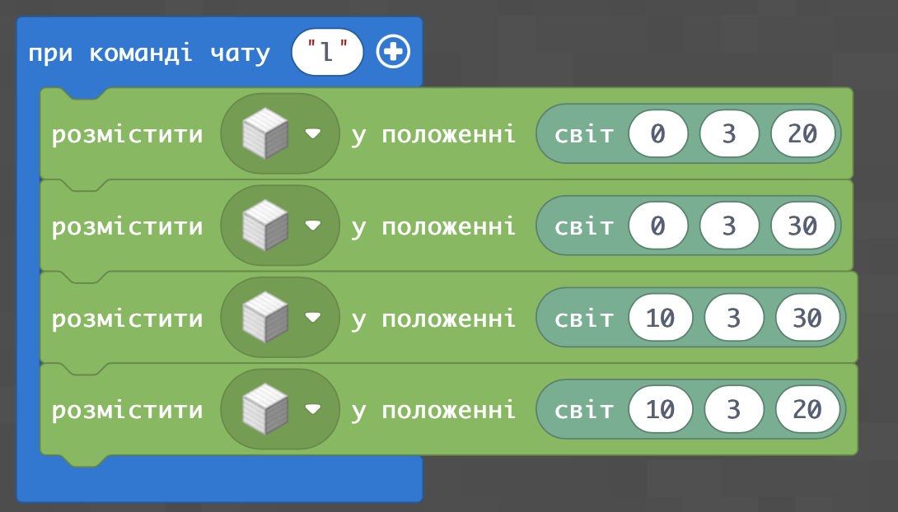    |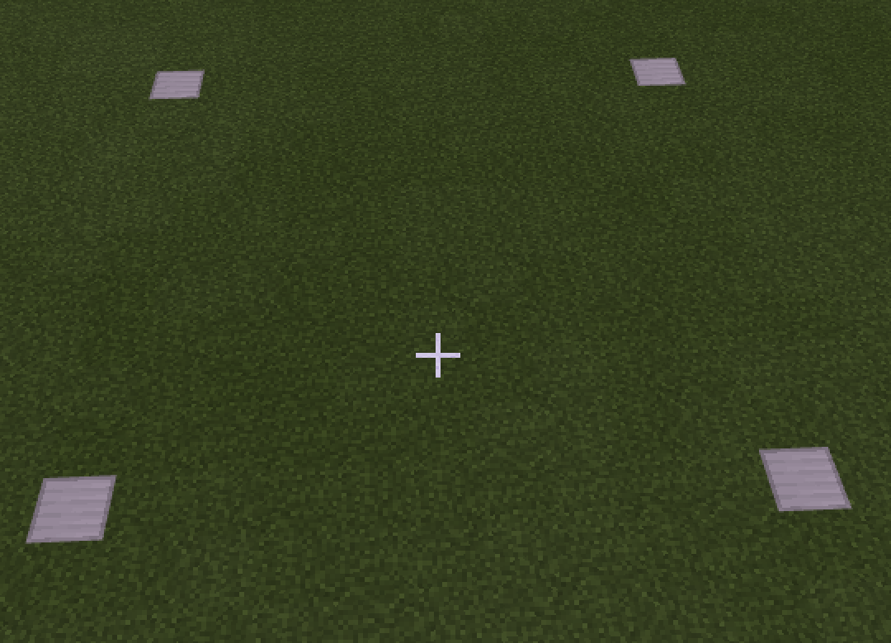  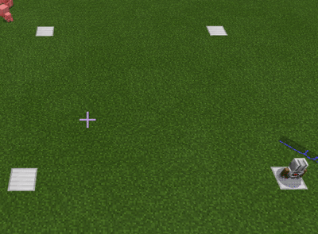|  

**Додаткові задачі:**
1. Зробіть прямокутник 10*5 з точки (0;4;60) обличчям на південь.
2. Зробіть прямокутник 10*5 з точки (0;4;60) обличчям на північ.
3. Зробіть прямокутник 10*5 з точки (0;4;60) обличчям на схід.
4. Зробіть прямокутник 10*5 з точки (0;4;60) обличчям на захід.

### Розстановка покажчиків. Поворот вправо.
Додамо для агента функціонал, щоб він при проходженні над золотим блоком повертав направо.

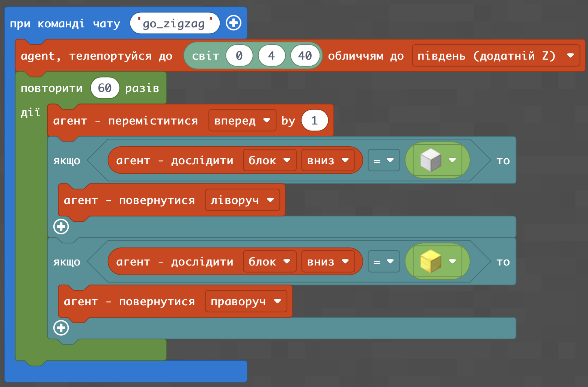

#|Завдання|Код|Результат|
|---|---|---|---|
|2| 1. Запустіть зигзаг із кроком 10 блоків, починаючи із точки (0;4;40) за схемою вперед-вліво-вперед-вправо-вперед-вправо-вперед через точки (0;4;40), (0;4;50), (10;4;50), (0;4;60).   2. Запустіть зигзаг із кроком 5 блоків, починаючи із точки (0;4;80) за схемою вперед-вліво-вперед-вправо-вперед-вправо-вперед через точки (0;4;80), (0;4;85), (5;4;85), (0;4;85).   3. Запустіть зигзаг із кроком 7 блоків, починаючи із точки (0;4;90) за схемою вперед-вліво-вперед-вправо-вперед-вправо-вперед через точки (0;4;90), (0;4;97), (7;4;97), (0;4;97).| 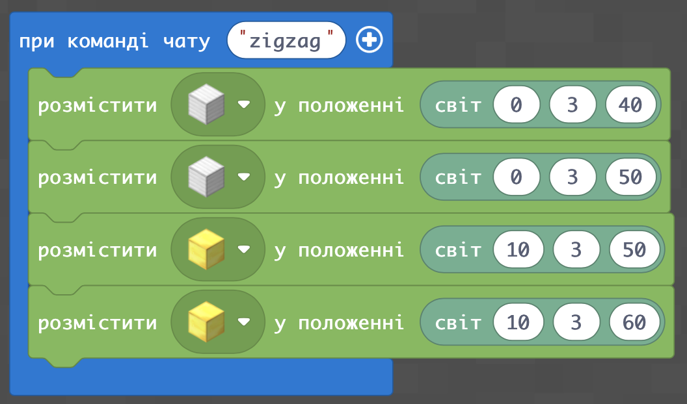  |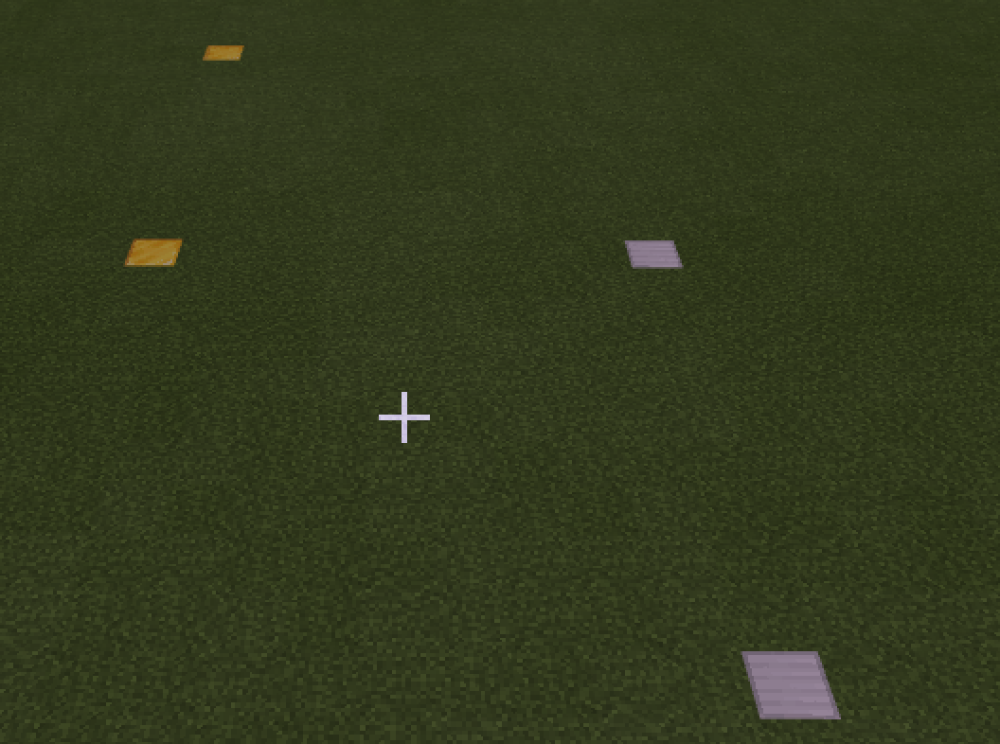  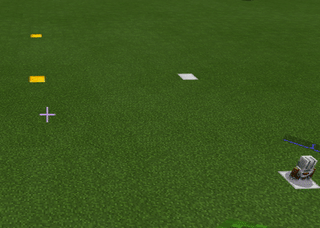 |

**Додаткові задачі:**
1. Зробіть зигзаг із 3-х блоків з точки (0;4;100) обличчям на південь.
2. Зробіть зигзаг із 3-х блоків з точки (0;4;100) обличчям на північ.
3. Зробіть зигзаг із 3-х блоків з точки (0;4;100) обличчям на схід.
4. Зробіть зигзаг із 3-х блоків з точки (0;4;100) обличчям на захід.

### Розстановка покажчиків. Поворот вправо.
В попередніх двох прикладах ми використовували для переміщення агенту цикл із визначеною кількістю повторювань. Такий цикл не залежить не від чого окрім саме кількості повторювань.  
Для того, шоб можна було зупинити агента в певній точці необхідно мати можливість зупинити виконання циклу.  
Для цього ми використаємо цикл, що виконується до тих пір, поки певна умова має значення "істина".

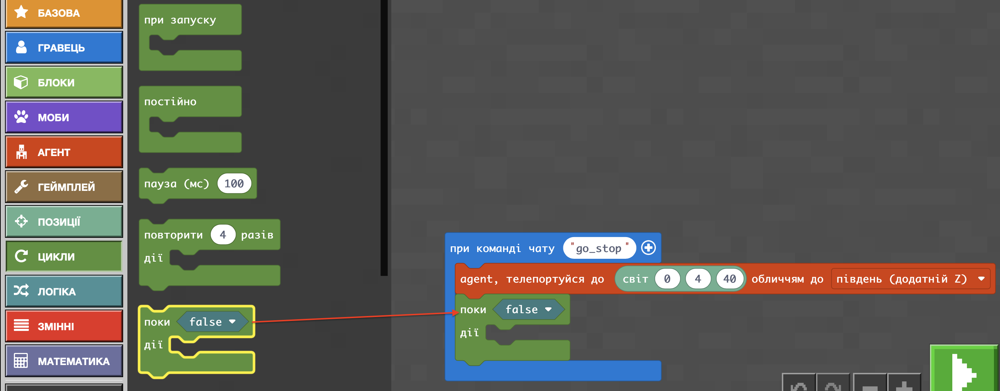  
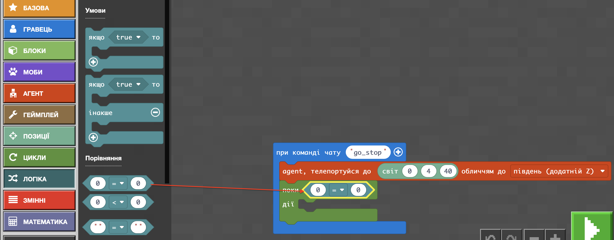  
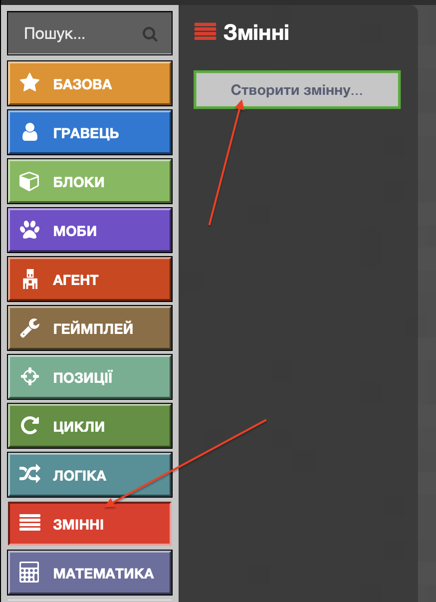  
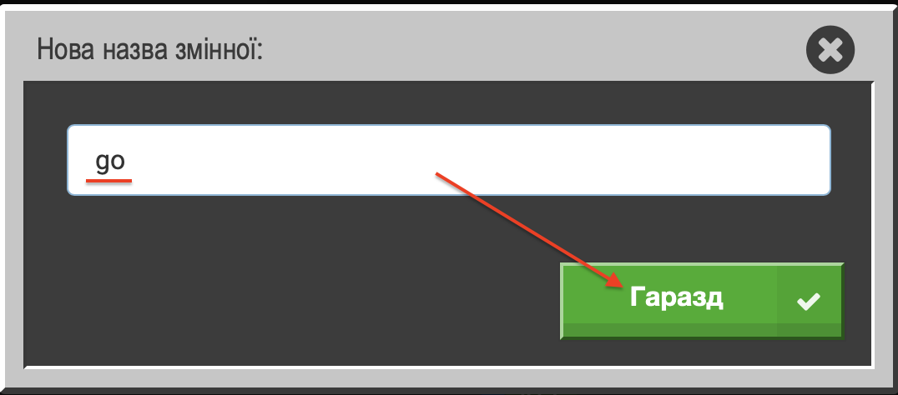  
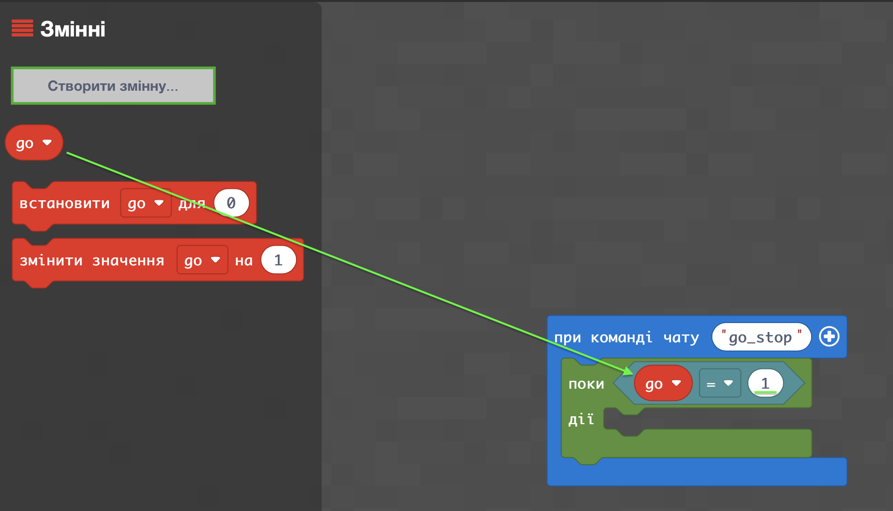  

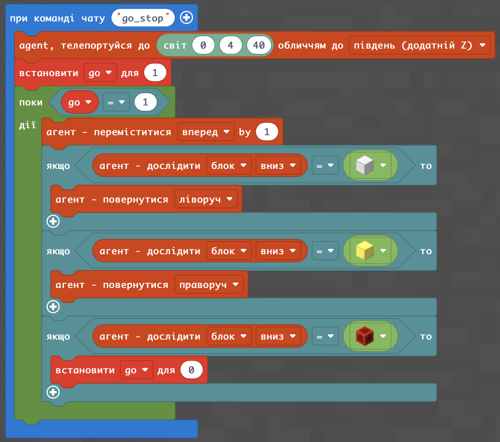 

#|Завдання|Код|Результат|
|---|---|---|---|
|3|1. Запустіть зигзаг із кроком 10 блоків, починаючи із точки (0;4;40) за схемою вперед-вліво-вперед-вправо-вперед-вправо-вперед через точки (0;4;40), (0;4;50), (10;4;50), (0;4;60). Із зупинкою в точці (0;4;60). 2. Запустіть зигзаг із кроком 5 блоків, починаючи із точки (0;4;80) за схемою вперед-вліво-вперед-вправо-вперед-вправо-вперед через точки (0;4;80), (0;4;85), (5;4;85), (0;4;85). Із зупинкою в точці (0;4;85). 3. Запустіть зигзаг із кроком 7 блоків, починаючи із точки (0;4;90) за схемою вперед-вліво-вперед-вправо-вперед-вправо-вперед через точки (0;4;90), (0;4;97), (7;4;97), (0;4;97). Із зупинкою в точці (0;4;97).|  |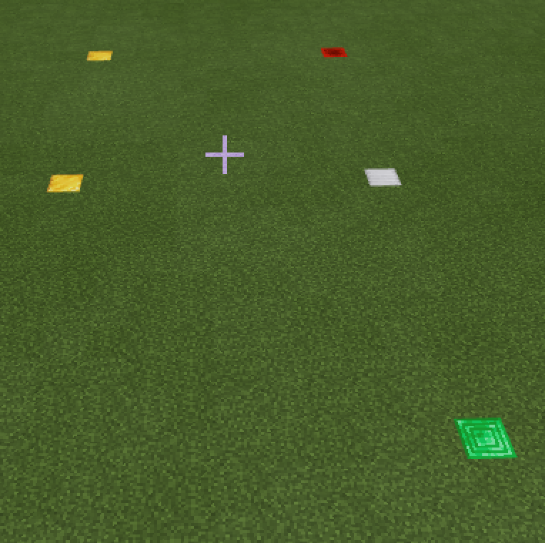   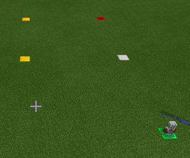  |
### Розстановка редстоуну
Додамо функцію для агенту, щоб при кожному кроці він ставив знизу себе пил редстоуну.
  
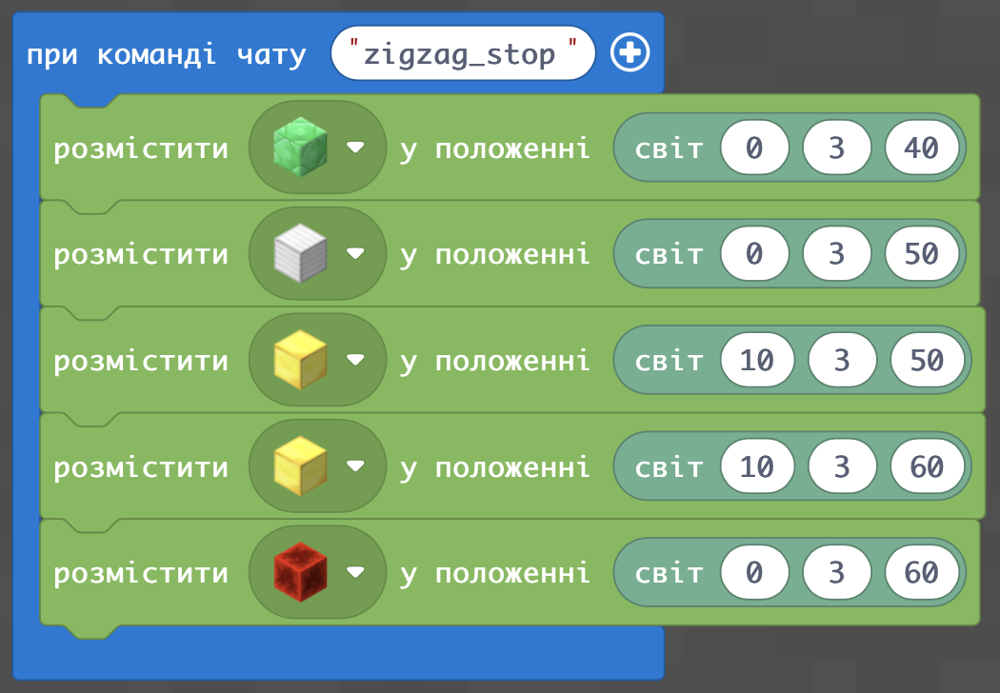    
   
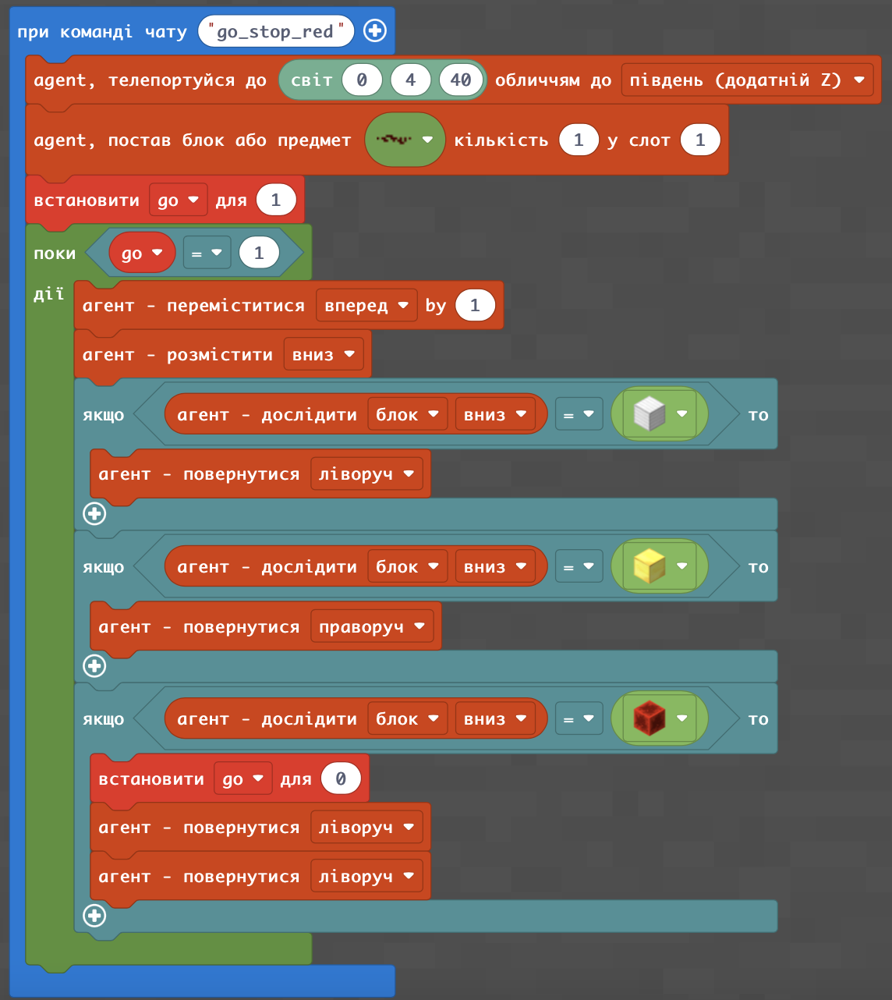      

&nbsp;    
     

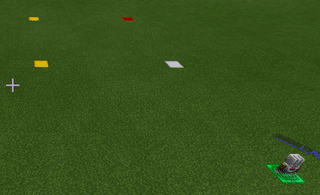   

  

Та якщо додати алгоритм повернення за наявністю редстоуну - агент повернеться на ту точку, з якої починав рух.

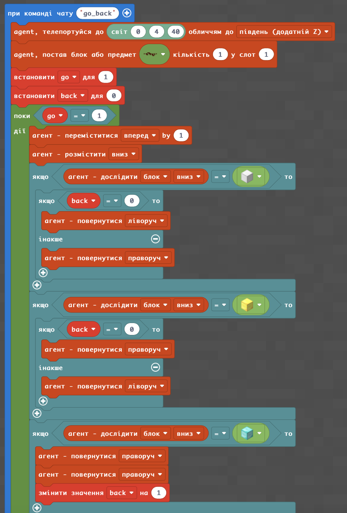  

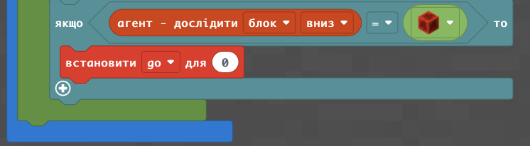    

&nbsp;  
  
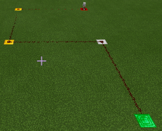  

## Творче завдання
1. Для лабіринту, який ви створили в минулому занятті проставте покажчики, які дозволяють агенту його пройти.
2. реалізуйте функціонал проходу так, щоб агент залишав за собою пил редстоуну.
3. ПРи досягненні кінця лабіринту - реалізуйте функціонал агента, щоб він зміг повернутися на початок лабіринту за залишеним пилом редстоуну.