# Вихід з лабіринту. Нить Аріадни.
Важливою властивістю лабіринту є те, що з нього дуже складно вийти. І однією зі стратегій, що дозволяє це зробити, є залишення після себе покажчика про те, що ви пройшли вже певну точку.  
В Minecraft ми можемо за агентом розміщувати пил редстоуну - він допоможе нам вибратися з лабіринту в майбутньому.

Спершу (**1**) - навчимося розміщувати пил редстоуну за допомогою коду. Сформуємо найпростішу траекторію майбутнього руху агента - квадрат. Далі - поставимо агента в точку на одній з вершин квадрату в напрямку руху (**2**), далі - навчимо аента рухатися так, щоб він йшов туди, де є пил редстоуну (**3**).
|#|Завдання|Код|Результат|
|---|---|---|---|
|1|1. Сформуйте квадрат з редстоуну від точок (50;4;50) до точки (40;4;60). 2. Сформуйте квадрат з редстоуну від точок (100;4;100) до точки (110;4;110). 3. Сформуйте довільний квадрат з редстоуну в довільній точці мапи. | |  |
|2|1. Поставте агента в точку (30;4;50) обличчям на південь|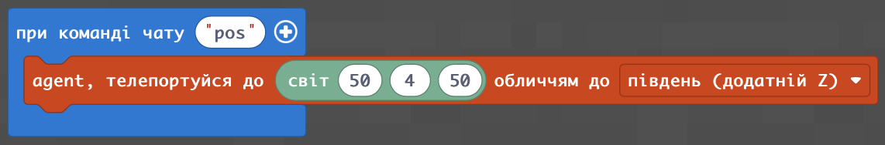 |  |
|3|Запрограмуйте прохід агента так, щоб він йшов за існуючою лінію з пилу редстоуну _(в цьому занятті хай даний код буде "пазлом", в майбутньому - ми будемо детально розбирати відповідні конструкції, але в цьому занятті ми просто набираємо даний код і запускаємо даний код "як є")_|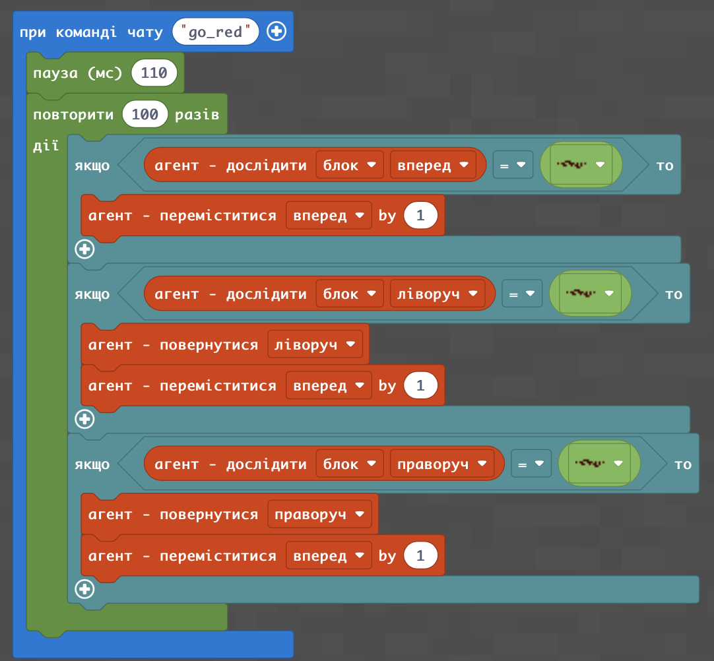 |  |
 

## Додаткове завдання.

|#|Завдання|Код|Результат|
|---|---|---|---|
|1|1. Сформуйте квадрат з редстоуну від точок (50;4;50) до точки (40;4;60)|  |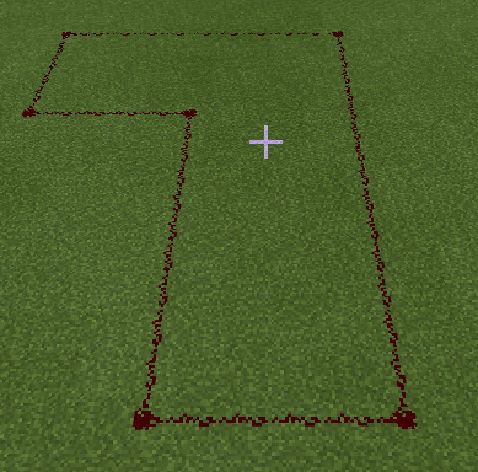    |
|2|1. Поставте агента в точку (30;4;50) обличчям на південь| |  |
|3|1. Запрограмуйте прохід агента так, щоб він йшов за існуючою лінію з пилу редстоуну.| |  |

## Керуючі блоки
|#|Завдання|Код|Результат|
|---|---|---|---|
|1. |1. Створіть управляючі блоки: блок смарагду (зелений) в точці старту (0;3;40), блок заліза (білий) - в місці повороту ліворуч (0;3;50), блоки золота (жовті) - в місцях повороту праворуч (10;3;50), (10;3;60), блок редстоуну (червоний) в точці закінчення пересування || |
|1. |---|| |
|1. |---|| |

 

## Лабіринт
Згадаємо створення лабіринту.  
|#|Опис задачі|Код|результат|
|---|---|---|---|
|1.|1. Створіть концентричні квадарти.|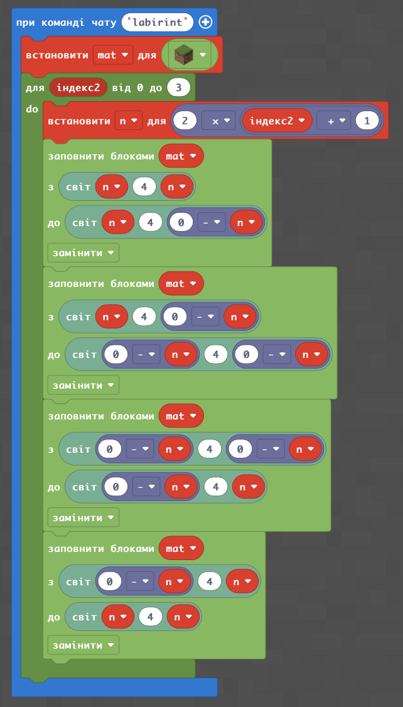  |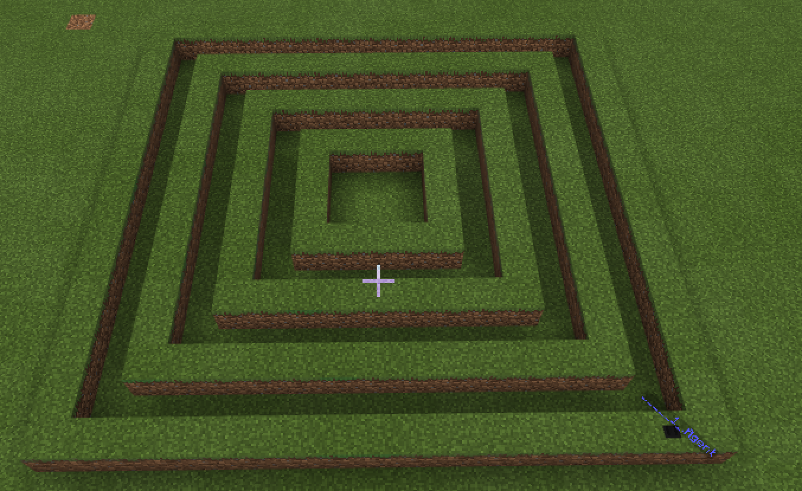  |
|2.|2. Створіть прогалини в концентричні квадратах.|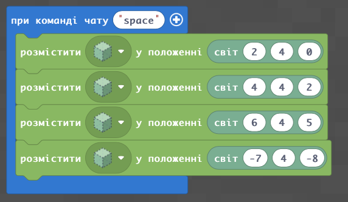  |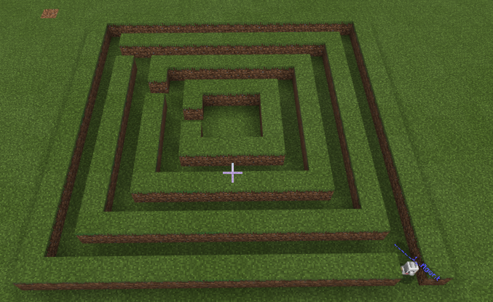  |
|3.|3. Створіть загородження в концентричні квадратах.|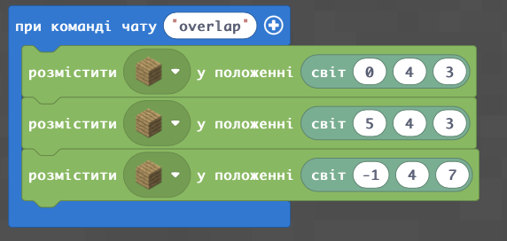  |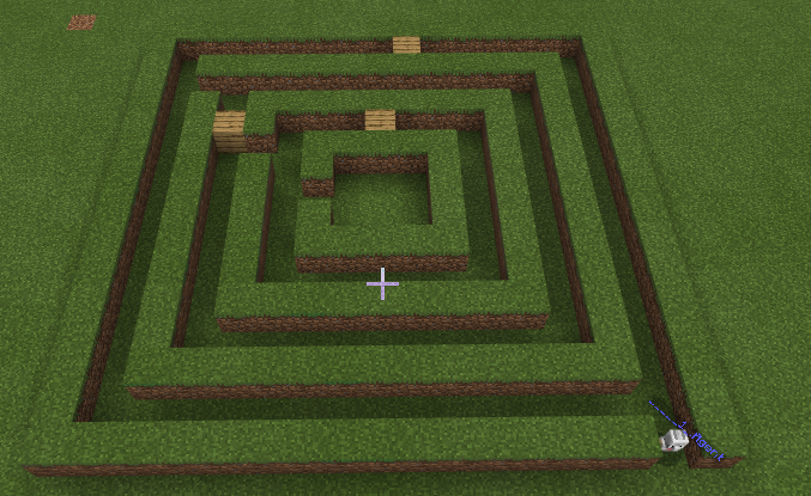  |
|4.|4. Позначте показники для проходу агента: золотий блок - поворот праворч, срібний блок - поворот ліворуч, блок редстуну - зупинка та розворот.|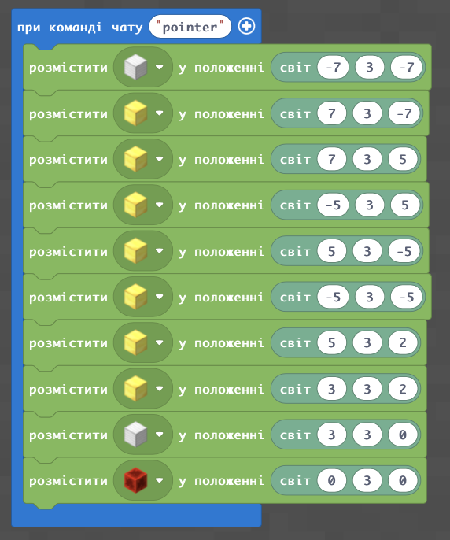  |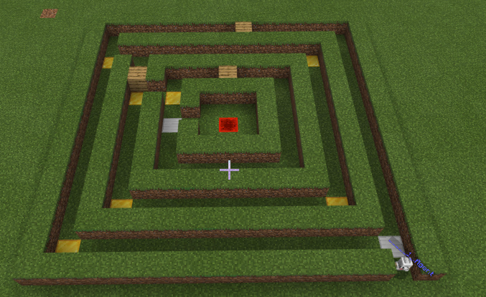  |
|5.|5. Реалізуйте прохід агента із залишанням за собою пилу редстоуну.|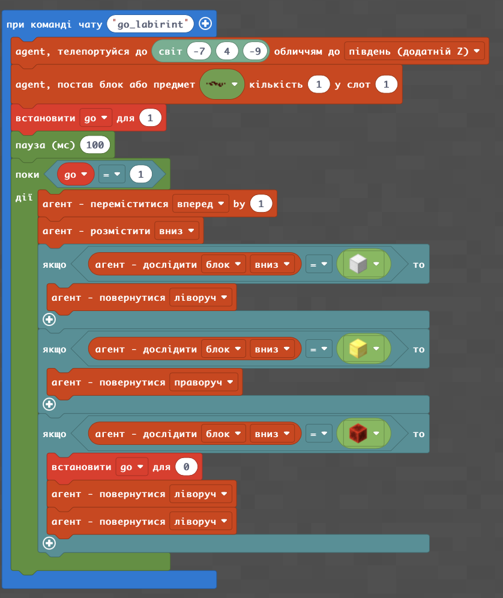  |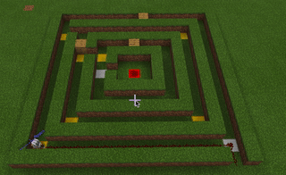  |
|6.|6. Реалізуйте прохід агента із залишанням за собою пилу редстоуну.|  |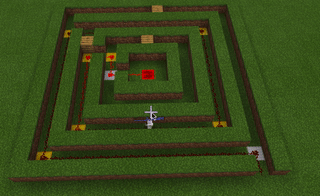  |
