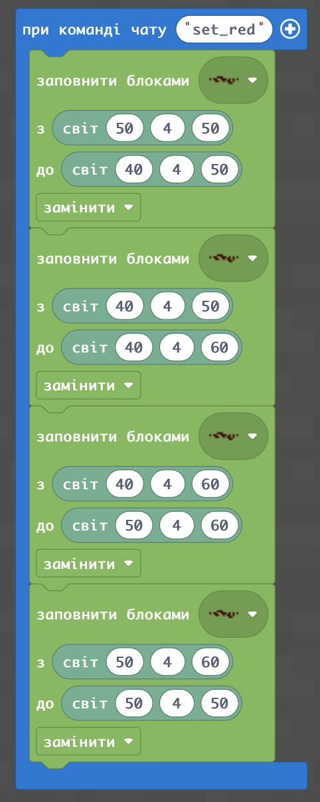
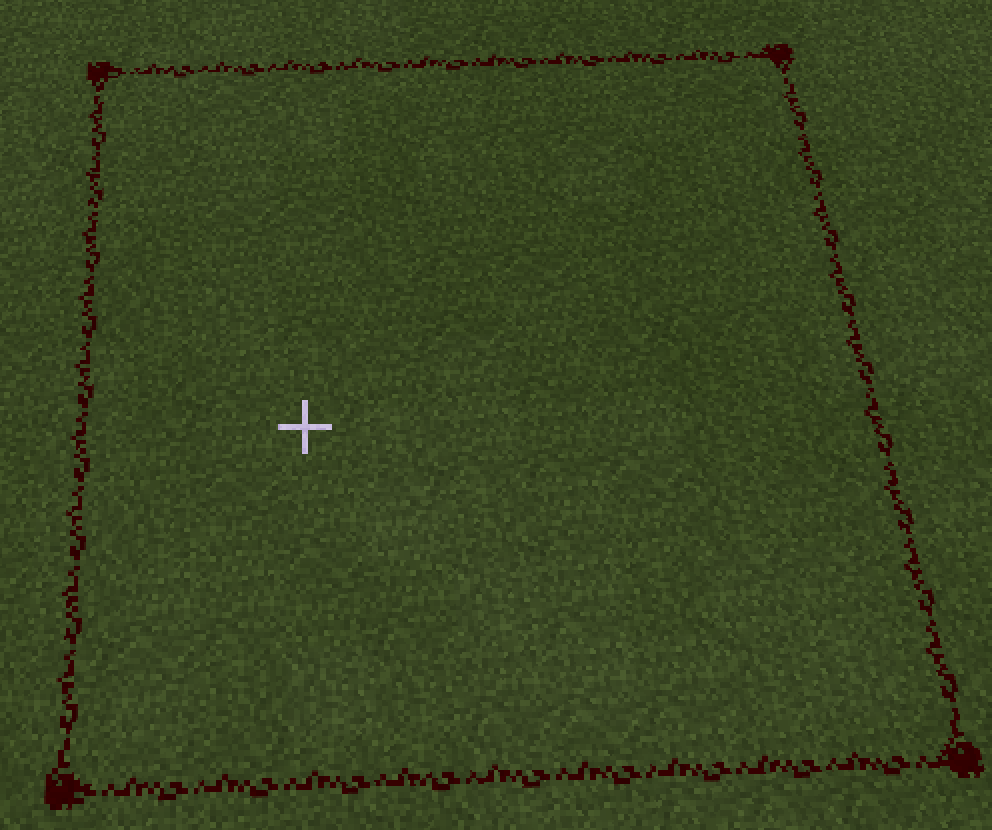
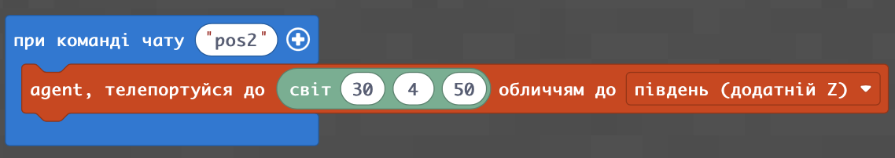
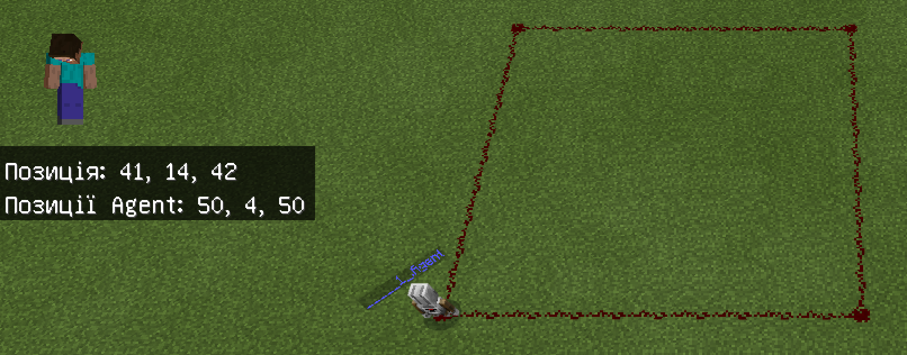
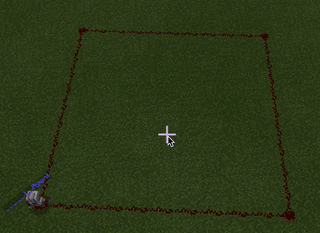
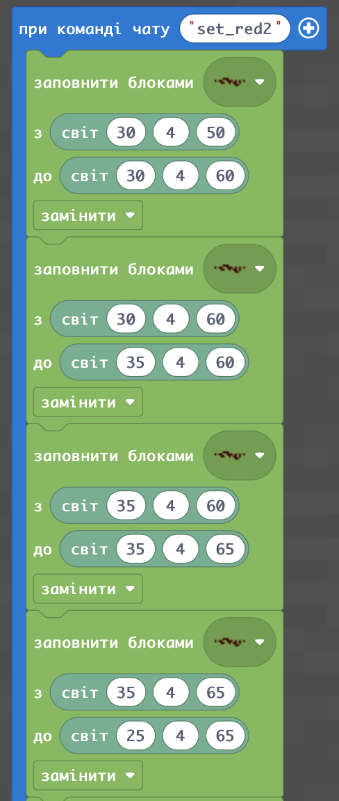
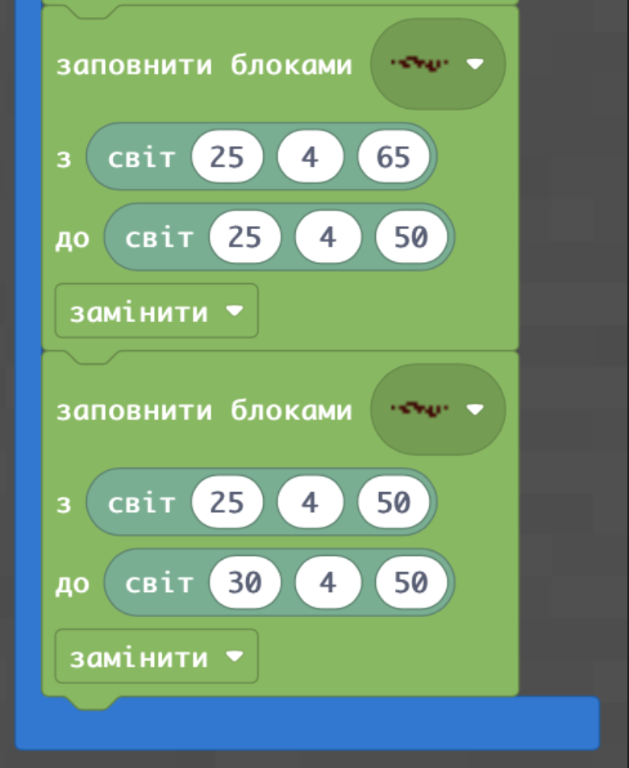
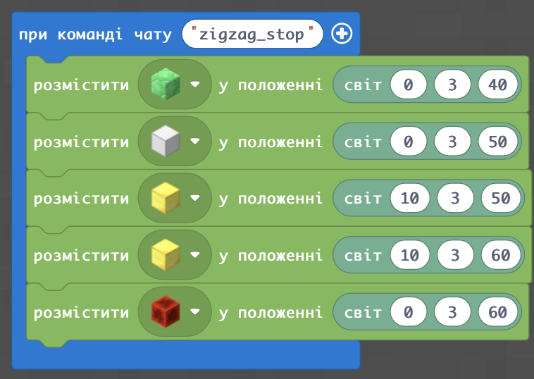
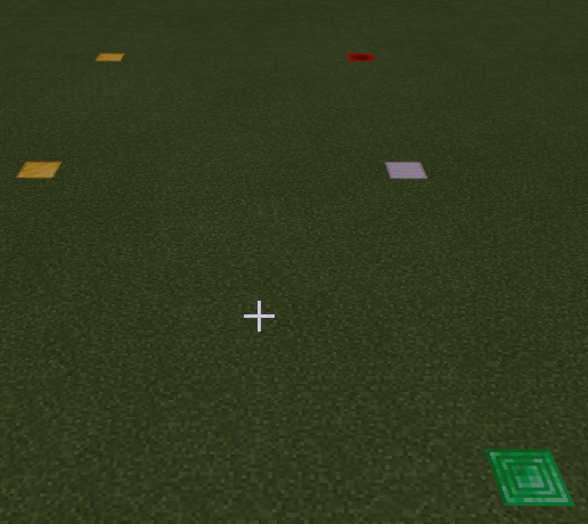
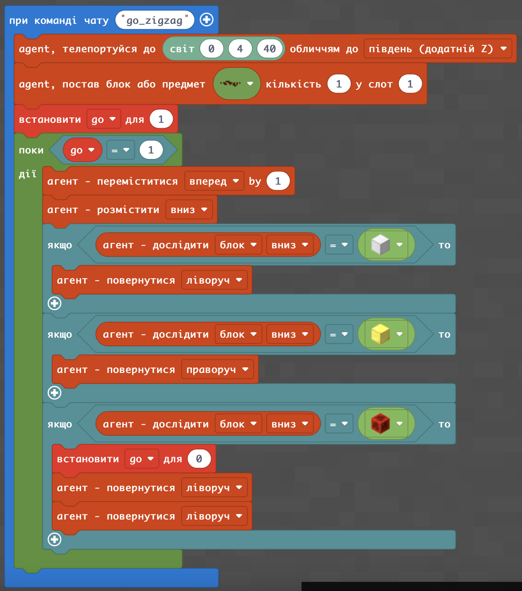

# Нить Аріадни
|#|Завдання|Код|Результат|
|---|---|---|---|
|1|1. Сформуйте квадрат з редстоуну від точок (50;4;50) до точки (40;4;60)| |  |
||1. Поставте агента в точку (30;4;50) обличчям на південь| |  |
 

  
  
  
  
  
  
  
