# Вихід з лабіринту. Нить Аріадни.
Важливою властивістю лабіринту є те, що з нього дуже складно вийти. І однією зі стратегій, що дозволяє це зробити, є залишення після себе покажчика про те, що ви пройшли вже певну точку.  
В Minecraft ми можемо за агентом розміщувати пил редстоуну - він допоможе нам вибратися з лабіринту в майбутньому.

Спершу (**1**) - навчимося розміщувати пил редстоуну за допомогою коду. Сформуємо найпростішу траекторію майбутнього руху агента - квадрат. Далі - поставимо агента в точку на одній з вершин квадрату в напрямку руху (**2**), далі - навчимо аента рухатися так, щоб він йшов туди, де є пил редстоуну (**3**).
|#|Завдання|Код|Результат|
|---|---|---|---|
|1|1. Сформуйте квадрат з редстоуну від точок (50;4;50) до точки (40;4;60). 2. Сформуйте квадрат з редстоуну від точок (100;4;100) до точки (110;4;110). 3. Сформуйте довільний квадрат з редстоуну в довільній точці мапи. |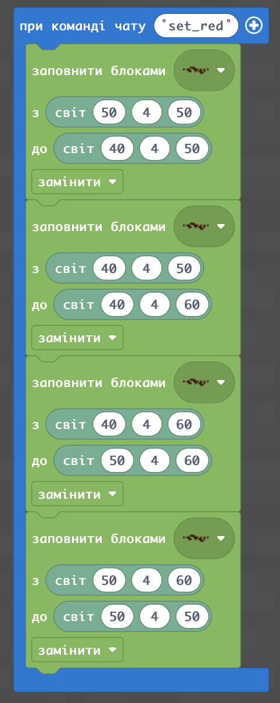 Код 1 |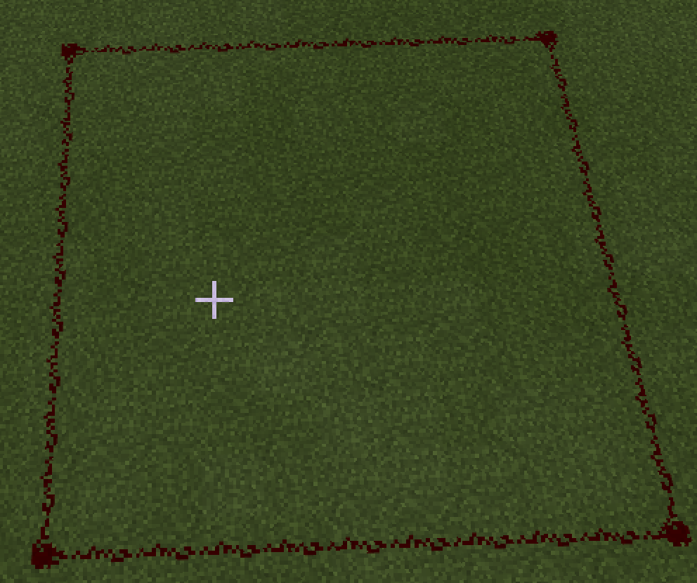  |
|2|1. Поставте агента в точку (30;4;50) обличчям на південь|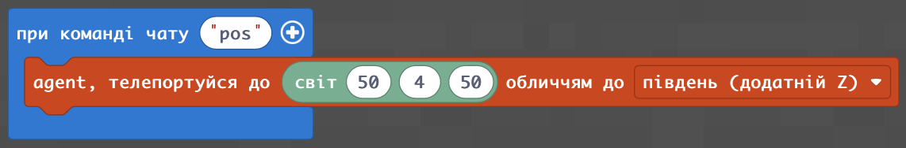 Код 2|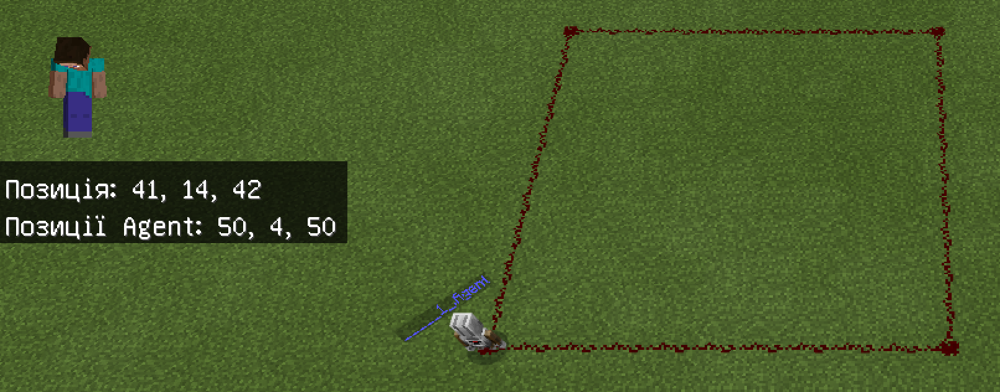  |
|3|Запрограмуйте прохід агента так, щоб він йшов за існуючою лінію з пилу редстоуну _(в цьому занятті хай даний код буде "пазлом", в майбутньому - ми будемо детально розбирати відповідні конструкції, але в цьому занятті ми просто набираємо даний код і запускаємо даний код "як є")_|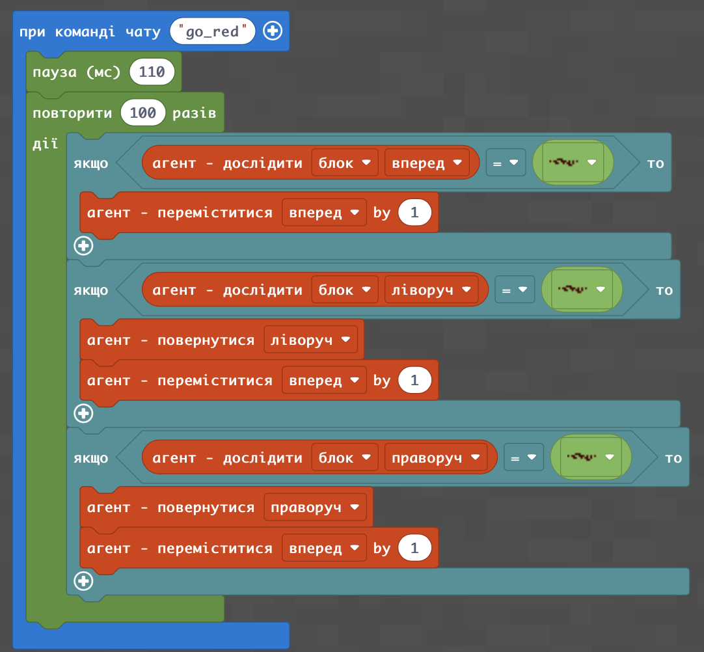 Код 3|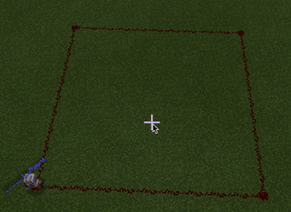  |

Код 1.
```js
player.onChat("set_red", function () {
    blocks.fill(
    REDSTONE_WIRE,
    world(50, 4, 50),
    world(40, 4, 50),
    FillOperation.Replace
    )
    blocks.fill(
    REDSTONE_WIRE,
    world(40, 4, 50),
    world(40, 4, 60),
    FillOperation.Replace
    )
    blocks.fill(
    REDSTONE_WIRE,
    world(40, 4, 60),
    world(50, 4, 60),
    FillOperation.Replace
    )
    blocks.fill(
    REDSTONE_WIRE,
    world(50, 4, 60),
    world(50, 4, 50),
    FillOperation.Replace
    )
})
```

Код 2
```js
player.onChat("pos", function () {
    agent.teleport(world(50, 4, 50), SOUTH)
})
```

Код 3
```js
player.onChat("go_red", function () {
    loops.pause(110)
    for (let index = 0; index < 100; index++) {
        if (agent.inspect(AgentInspection.Block, FORWARD) == REDSTONE_WIRE) {
            agent.move(FORWARD, 1)
        }
        if (agent.inspect(AgentInspection.Block, LEFT) == REDSTONE_WIRE) {
            agent.turn(LEFT_TURN)
            agent.move(FORWARD, 1)
        }
        if (agent.inspect(AgentInspection.Block, RIGHT) == REDSTONE_WIRE) {
            agent.turn(RIGHT_TURN)
            agent.move(FORWARD, 1)
        }
    }
})

```

## Додаткове завдання.

|#|Завдання|Код|Результат|
|---|---|---|---|
|1|1. Сформуйте квадрат з редстоуну від точок (50;4;50) до точки (40;4;60)|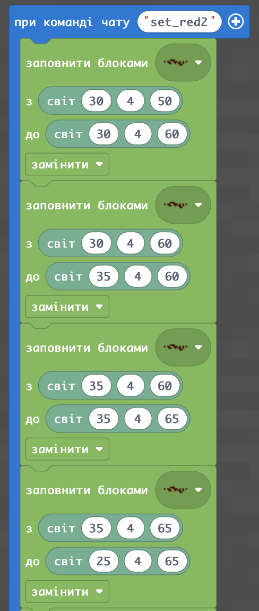<br>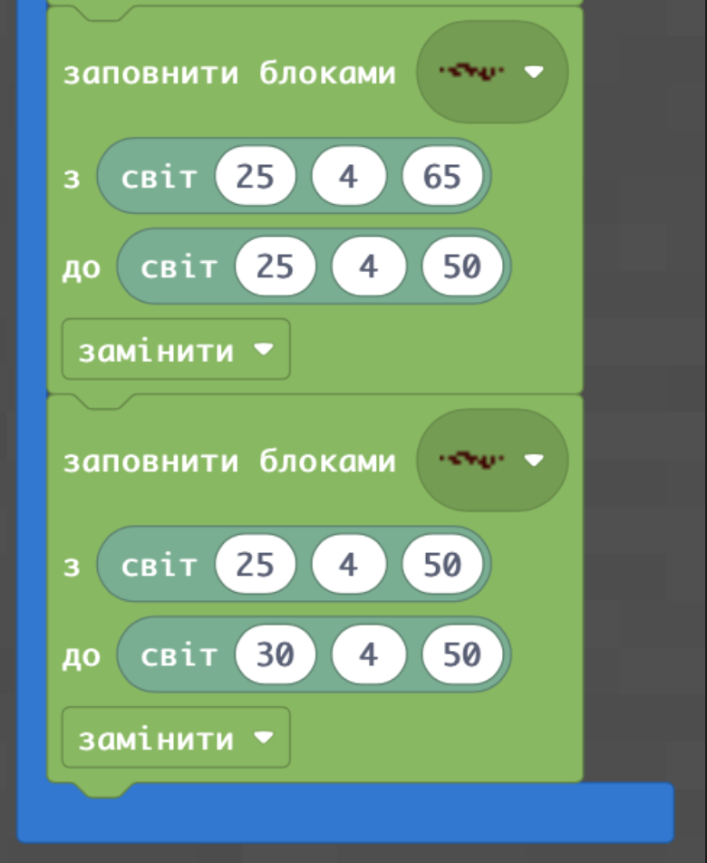 Код 4|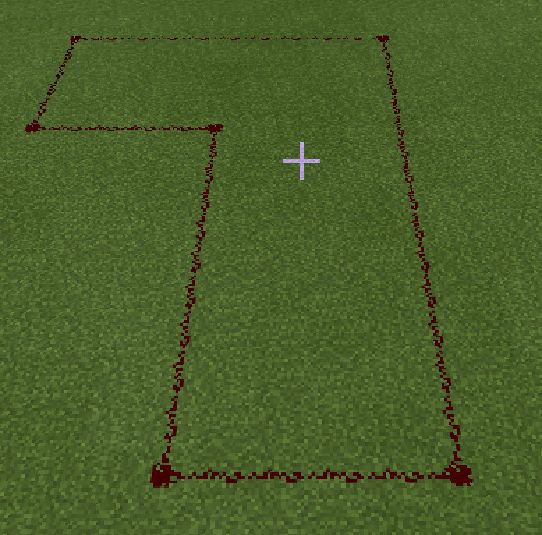    |
|2|1. Поставте агента в точку (30;4;50) обличчям на південь|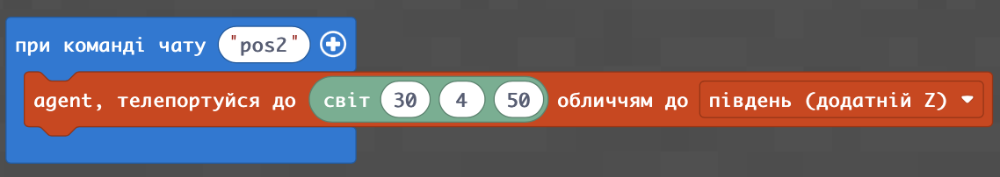 Код 5|  |
|3|1. Запрограмуйте прохід агента так, щоб він йшов за існуючою лінію з пилу редстоуну.| код 3 |  |

Код 4
```js
player.onChat("set_red2", function () {
    blocks.fill(
    REDSTONE_WIRE,
    world(30, 4, 50),
    world(30, 4, 60),
    FillOperation.Replace
    )
    blocks.fill(
    REDSTONE_WIRE,
    world(30, 4, 60),
    world(35, 4, 60),
    FillOperation.Replace
    )
    blocks.fill(
    REDSTONE_WIRE,
    world(35, 4, 60),
    world(35, 4, 65),
    FillOperation.Replace
    )
    blocks.fill(
    REDSTONE_WIRE,
    world(35, 4, 65),
    world(25, 4, 65),
    FillOperation.Replace
    )
    blocks.fill(
    REDSTONE_WIRE,
    world(35, 4, 65),
    world(25, 4, 65),
    FillOperation.Replace
    )
    blocks.fill(
    REDSTONE_WIRE,
    world(25, 4, 65),
    world(25, 4, 50),
    FillOperation.Replace
    )
    blocks.fill(
    REDSTONE_WIRE,
    world(25, 4, 50),
    world(30, 4, 50),
    FillOperation.Replace
    )
})

```

Код 5

```js
player.onChat("pos2", function () {
    agent.teleport(world(30, 4, 50), SOUTH)
})

```


## Керуючі блоки
|#|Завдання|Код|Результат|
|---|---|---|---|
|1. |1. Створіть управляючі блоки: блок смарагду (зелений) в точці старту (0;3;40), блок заліза (білий) - в місці повороту ліворуч (0;3;50), блоки золота (жовті) - в місцях повороту праворуч (10;3;50), (10;3;60), блок редстоуну (червоний) в точці закінчення пересування |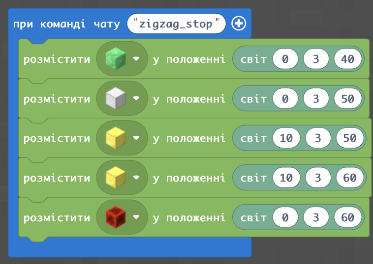 код 6|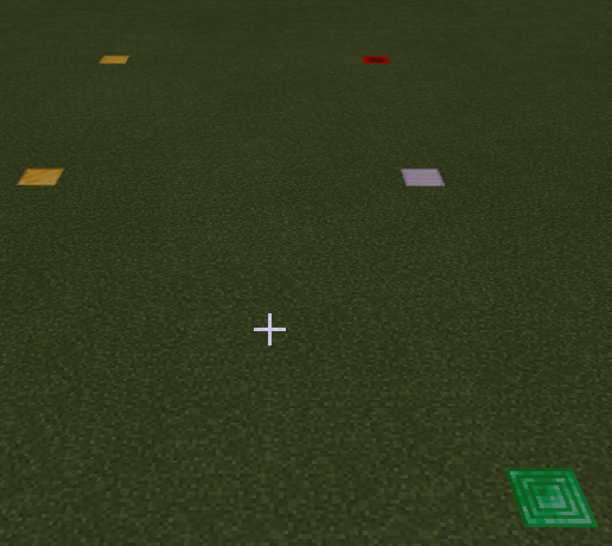 |
|1. |---|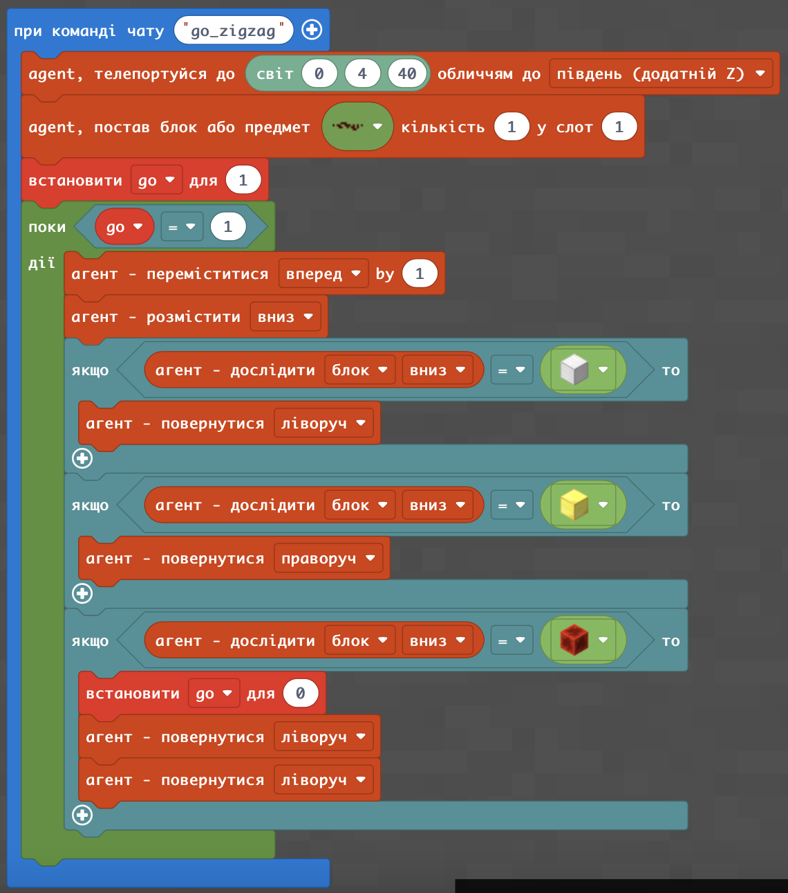 код 7| |
|1. |---| код 8| |

Код 6
```js
player.onChat("zigzag_stop", function () {
    blocks.place(EMERALD_BLOCK, world(0, 3, 40))
    blocks.place(IRON_BLOCK, world(0, 3, 50))
    blocks.place(GOLD_BLOCK, world(10, 3, 50))
    blocks.place(GOLD_BLOCK, world(10, 3, 60))
    blocks.place(REDSTONE_BLOCK, world(0, 3, 60))
})
```
 
 Код 7
```js
player.onChat("go_zigzag", function () {
    agent.teleport(world(0, 4, 40), SOUTH)
    agent.setItem(REDSTONE_WIRE, 1, 1)
    go = 1
    while (go == 1) {
        agent.move(FORWARD, 1)
        agent.place(DOWN)
        if (agent.inspect(AgentInspection.Block, DOWN) == IRON_BLOCK) {
            agent.turn(LEFT_TURN)
        }
        if (agent.inspect(AgentInspection.Block, DOWN) == GOLD_BLOCK) {
            agent.turn(RIGHT_TURN)
        }
        if (agent.inspect(AgentInspection.Block, DOWN) == REDSTONE_BLOCK) {
            go = 0
            agent.turn(LEFT_TURN)
            agent.turn(LEFT_TURN)
        }
    }
})

```

Код 8
```js
player.onChat("go_red", function () {
    loops.pause(110)
    for (let index = 0; index < 100; index++) {
        if (agent.inspect(AgentInspection.Block, FORWARD) == REDSTONE_WIRE) {
            agent.move(FORWARD, 1)
        }
        if (agent.inspect(AgentInspection.Block, LEFT) == REDSTONE_WIRE) {
            agent.turn(LEFT_TURN)
            agent.move(FORWARD, 1)
        }
        if (agent.inspect(AgentInspection.Block, RIGHT) == REDSTONE_WIRE) {
            agent.turn(RIGHT_TURN)
            agent.move(FORWARD, 1)
        }
    }
})

```


## Лабіринт
Згадаємо створення лабіринту.  
|#|Опис задачі|Код|результат|
|---|---|---|---|
|1.|1. Створіть концентричні квадарти.|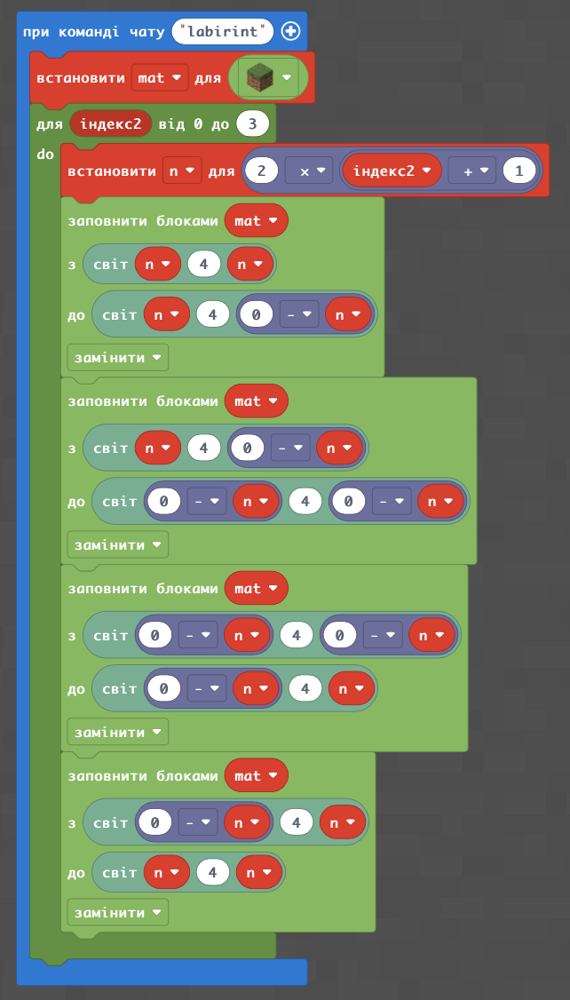 Код 9 |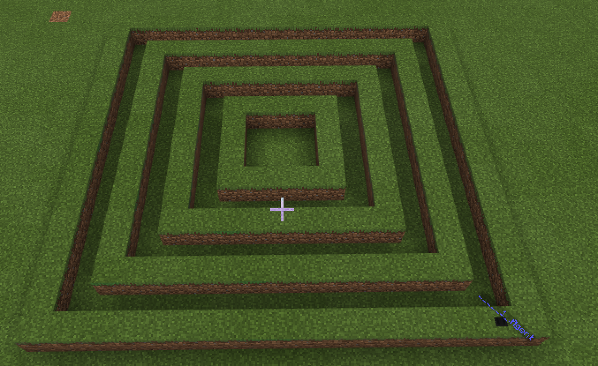  |
|2.|2. Створіть прогалини в концентричні квадратах.|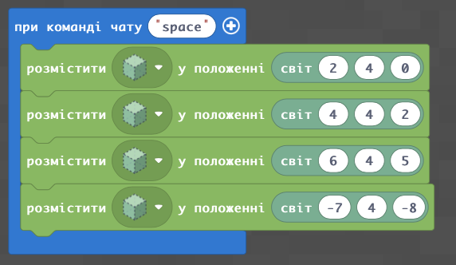  Код 10|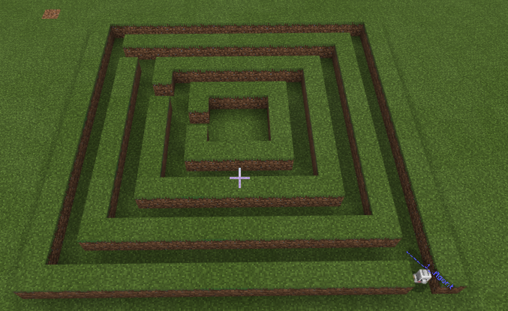  |
|3.|3. Створіть загородження в концентричні квадратах.|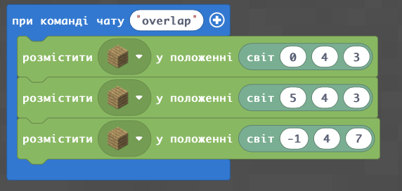 Код 11 |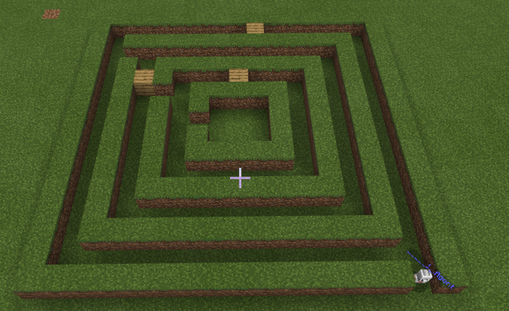  |
|4.|4. Позначте показники для проходу агента: золотий блок - поворот праворч, срібний блок - поворот ліворуч, блок редстуну - зупинка та розворот.|  Код 12|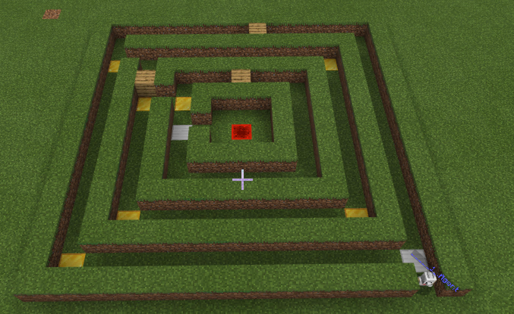  |
|5.|5. Реалізуйте прохід агента із залишанням за собою пилу редстоуну.|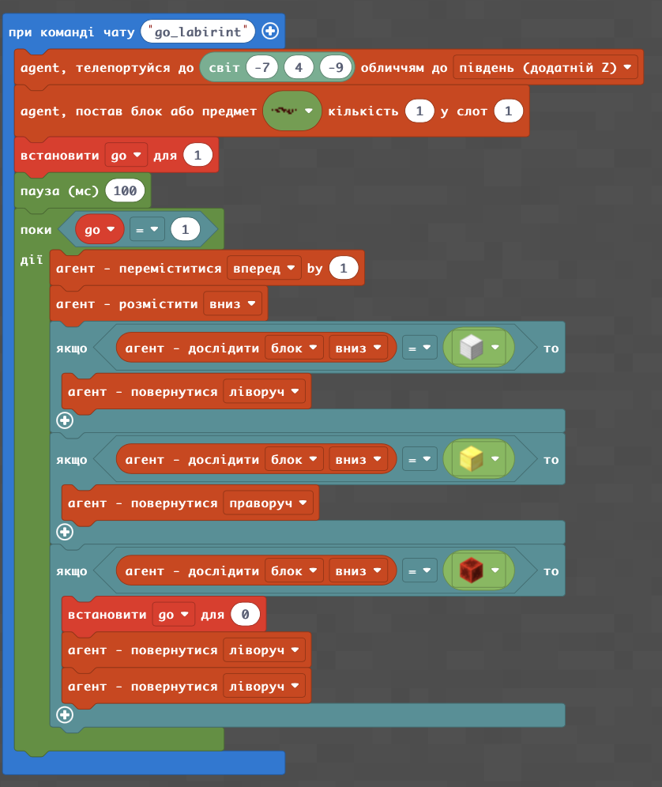  Код 13|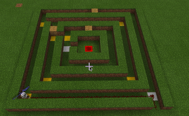  |
|6.|6. Реалізуйте прохід агента із залишанням за собою пилу редстоуну.|  Код 14|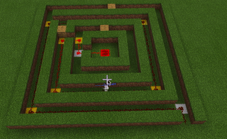  |

```js
player.onChat("labirint", function () {
    mat = GRASS
    for (let індекс2 = 0; індекс2 <= 3; індекс2++) {
        n = 2 * (індекс2 + 1)
        blocks.fill(
        mat,
        world(n, 4, n),
        world(n, 4, 0 - n),
        FillOperation.Replace
        )
        blocks.fill(
        mat,
        world(n, 4, 0 - n),
        world(0 - n, 4, 0 - n),
        FillOperation.Replace
        )
        blocks.fill(
        mat,
        world(0 - n, 4, 0 - n),
        world(0 - n, 4, n),
        FillOperation.Replace
        )
        blocks.fill(
        mat,
        world(0 - n, 4, n),
        world(n, 4, n),
        FillOperation.Replace
        )
    }
})
```
Код 9


```js
player.onChat("space", function () {
    blocks.place(AIR, world(2, 4, 0))
    blocks.place(AIR, world(4, 4, 2))
    blocks.place(AIR, world(6, 4, 5))
    blocks.place(AIR, world(-7, 4, -8))
})

```
Код 10


```js
player.onChat("overlap", function () {
    blocks.place(PLANKS_OAK, world(0, 4, 3))
    blocks.place(PLANKS_OAK, world(5, 4, 3))
    blocks.place(PLANKS_OAK, world(-1, 4, 7))
})


```
Код 11

```js
player.onChat("pointer", function () {
    blocks.place(IRON_BLOCK, world(-7, 3, -7))
    blocks.place(GOLD_BLOCK, world(7, 3, -7))
    blocks.place(GOLD_BLOCK, world(7, 3, 5))
    blocks.place(GOLD_BLOCK, world(-5, 3, 5))
    blocks.place(GOLD_BLOCK, world(5, 3, -5))
    blocks.place(GOLD_BLOCK, world(-5, 3, -5))
    blocks.place(GOLD_BLOCK, world(5, 3, 2))
    blocks.place(GOLD_BLOCK, world(3, 3, 2))
    blocks.place(IRON_BLOCK, world(3, 3, 0))
    blocks.place(REDSTONE_BLOCK, world(0, 3, 0))
})


```
Код 12


```js
player.onChat("go_labirint", function () {
    agent.teleport(world(-7, 4, -9), SOUTH)
    agent.setItem(REDSTONE_WIRE, 1, 1)
    go = 1
    loops.pause(100)
    while (go == 1) {
        agent.move(FORWARD, 1)
        agent.place(DOWN)
        if (agent.inspect(AgentInspection.Block, DOWN) == IRON_BLOCK) {
            agent.turn(LEFT_TURN)
        }
        if (agent.inspect(AgentInspection.Block, DOWN) == GOLD_BLOCK) {
            agent.turn(RIGHT_TURN)
        }
        if (agent.inspect(AgentInspection.Block, DOWN) == REDSTONE_BLOCK) {
            go = 0
            agent.turn(LEFT_TURN)
            agent.turn(LEFT_TURN)
        }
    }
})


```
Код 13

```js
player.onChat("go_red", function () {
    loops.pause(110)
    for (let index = 0; index < 100; index++) {
        if (agent.inspect(AgentInspection.Block, FORWARD) == REDSTONE_WIRE) {
            agent.move(FORWARD, 1)
        }
        if (agent.inspect(AgentInspection.Block, LEFT) == REDSTONE_WIRE) {
            agent.turn(LEFT_TURN)
            agent.move(FORWARD, 1)
        }
        if (agent.inspect(AgentInspection.Block, RIGHT) == REDSTONE_WIRE) {
            agent.turn(RIGHT_TURN)
            agent.move(FORWARD, 1)
        }
    }
})


```
Код 14


  
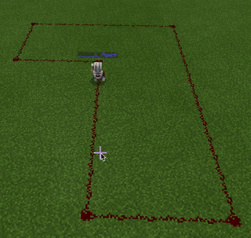  
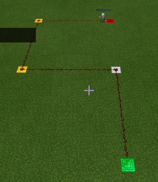  
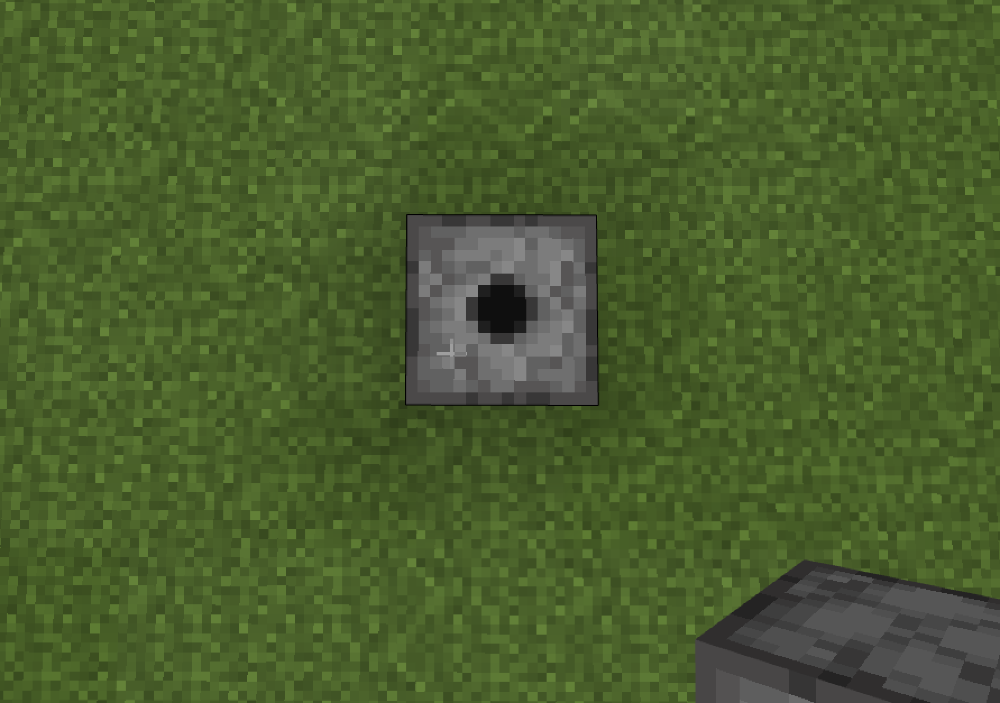  
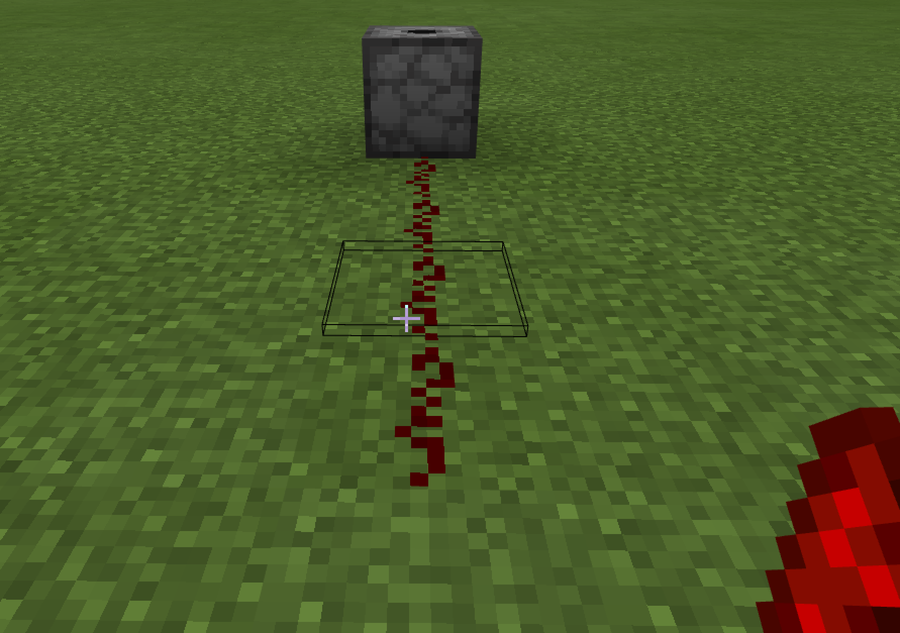  
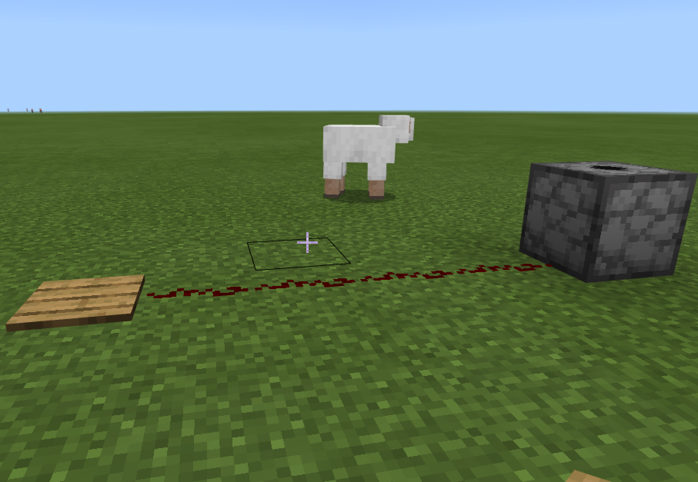  
  
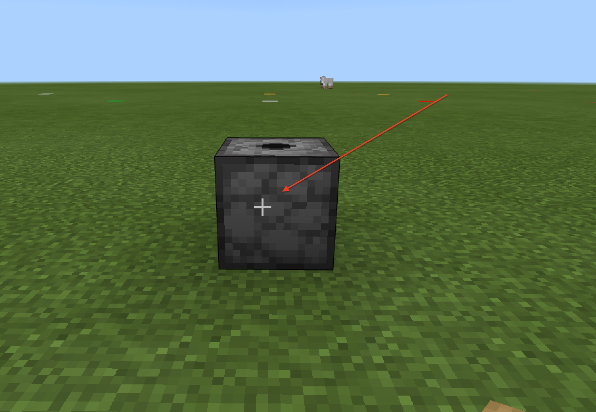  
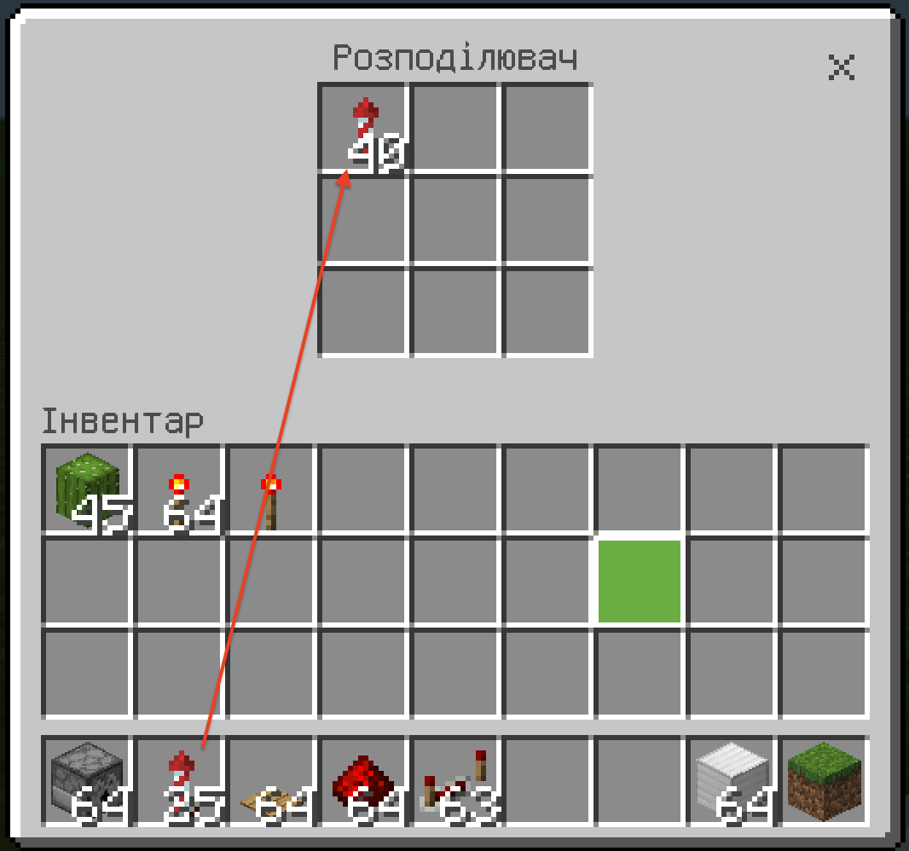  
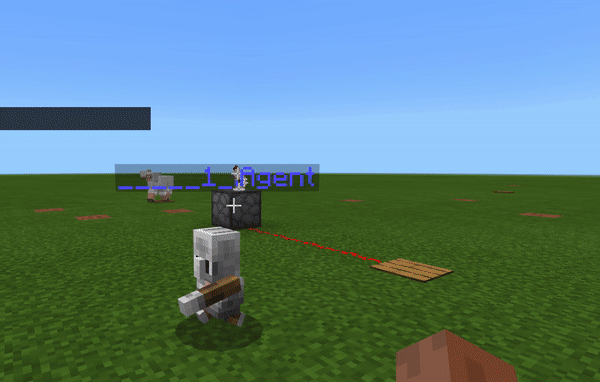  
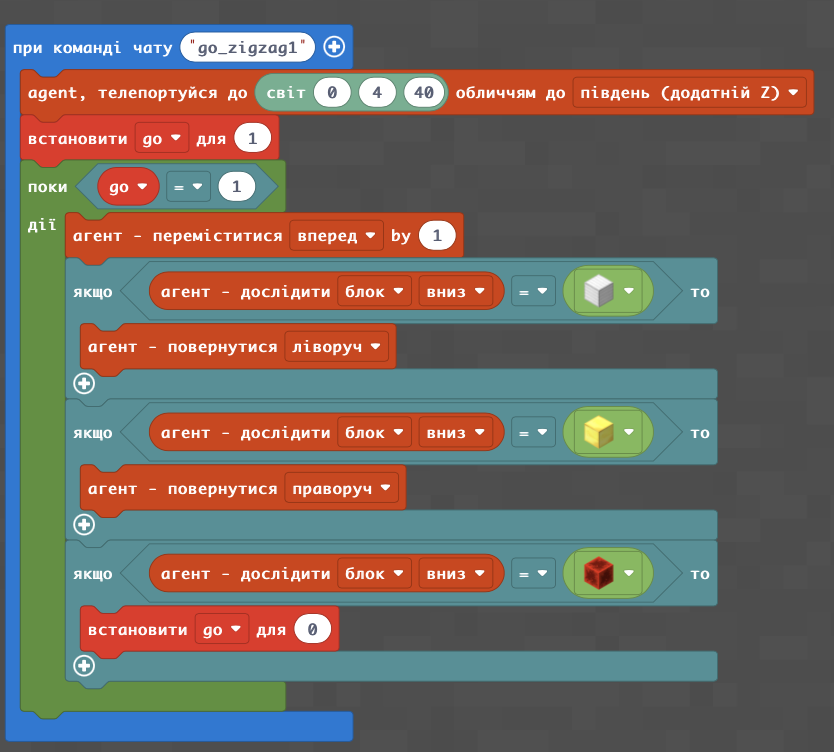  
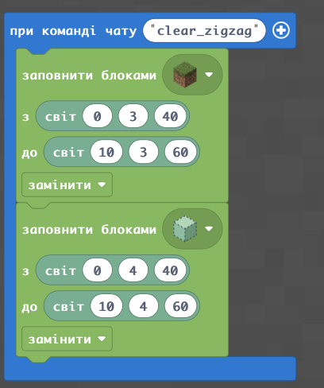  
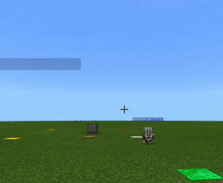  


```js


```
Код 15
