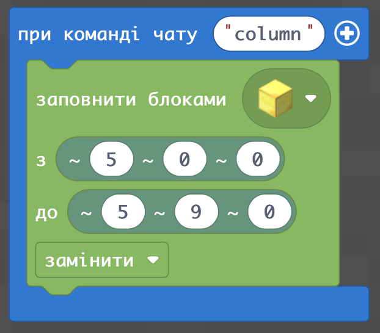

# Пирамида
## Колонна
|#|Название|Альтернативные задания|Код|Результат|
|---|---|---|---|---|
|3|Колонна|1. Сделайте колонну из блоков золота высотой 10 блоков.   2. Сделайте колонну из досок дуба высотой 15 блоков. 3. Сделайте колонну из алмазных блоков высотой 11 блоков.  4. Сделайте колонну из блоков динамита высотой 17 блоков. 5. Сделайте колонну из блоков желтого бетона высотой 11 блоков.|||

### Творческое задание
Поставьте флаги на флагштоках.  
|#|Название|Альтернативные задания|Код|Результат|
|---|---|---|---|---|
|4|Флаг-шток|1. Поставьте на флаг-штоке из золотых блоков высотой 10 блоков с флагом Украины ||  |

## Слоеный пирог

|#|Название|Альтернативные задания|Код|Результат|
|---|---|---|---|---|
|5|"Слоеный пирог"|1. Создайте блок из 5 слоев из бетона в такой последовательности (желтый, белый, желтый, белый, желтый), основание которых 5 на 5|||

## Пирамида блоками элементов
В прошлых заданиях мы с вами научились строить линии и прямоугольники. 
|#|Название|Альтернативные задания|Код|Результат|
|---|---|---|---|---|
|6|Пирамида|1. Создайте пирамиду из 6 уровней из песчаника, размер нижнего слоя 11х11.|||

Теперь - добавим к этому еще и высоту. 
Например, сделаем колонну. 

Дополнительное задание - сделаем флаг-шток.

А теперь - сделаем слоеный пирог: несколько элементов разных цветов один под одним,
поставим несколько блоков на нескольких уровняхс

## Пирамида с помощью циклов
|#|Название|Альтернативные задания|Код|Результат|
|---|---|---|---|---|
|7|Пирамида|1. Создайте пирамиду из 6 уровней из песчаника, размер нижнего слоя 11х11.|||

## Большая пирамида

|#|Название|Альтернативные задания|Код|Результат|
|---|---|---|---|---|
|8|Пирамида|1. Создайте пирамиду из 50 уровней из песчаника.|||

## Пирамида с помощью цикла и с параметром
|#|Название|Альтернативные задания|Код|Результат|
|---|---|---|---|---|
|9|Пирамида|1. Создайте пирамиду при команде `pyr 50`|||

